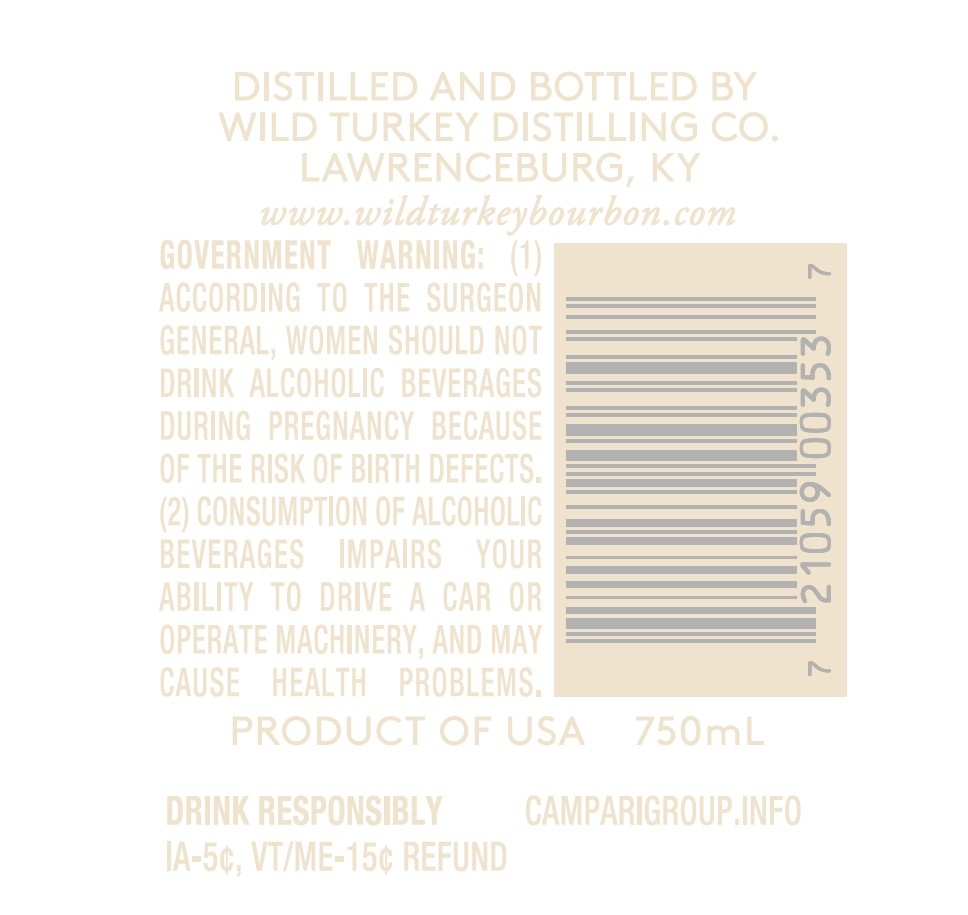
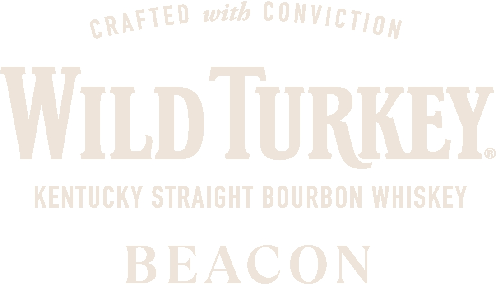
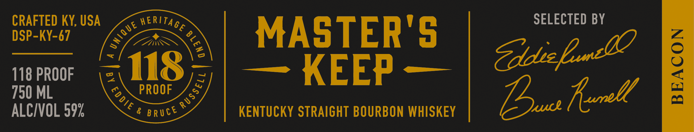

# TTB COLA Label Images - TTBID 24163001000770

**Brand Name:** WILD TURKEY

**Fanciful Name:** BEACON

**Issue Date:** 06/12/2024

**Origin Code:** 22

**Product Class/Type:** 101

**Source:** [TTB Public COLA Registry](https://ttbonline.gov/colasonline/viewColaDetails.do?action=publicFormDisplay&ttbid=24163001000770)

## Label Images

### Back Label

### Front Label

### Label 2

## Extracted Label Text

*Text extracted via OCR - may contain errors*

### Back Label

DISTILLED AND BOTTLED BY

WILD TURKEY DISTILLING CO.

LAWRENCEBURG, KY

www.wildturkeybourbon.com

GOVERNMENT WARNING: (1)

ACCORDING TO THE SURGEON

GENERAL, WOMEN SHOULD NOT

DRINK ALCOHOLIC BEVERAGES

DURING PREGNANCY BECAUSE

OF THE RISK OF BIRTH DEFECTS.

(2) CONSUMPTION OF ALCOHOLIC

BEVERAGES IMPAIRS YOUR

ABILITY TO DRIVE A CAR OR

OPERATE MACHINERY, AND MAY

CAUSE HEALTH PROBLEMS.

PRODUCT OF USA 750mL

DRINK RESPONSIBLY

CAMPARIGROUP. INFO

IA-5¢, VI/ME-15¢ REFUND

### Front Label

CRAFTED with CONVICTIgy

WILD IURKEY

KENTUCKY STRAIGHT BOURBON WHISKEY

BEACON

### Label 2

SELECTED BY

FLED KY, USA

g MERTAg

v— a

MASTER'S

los

Sdie

118 PROOF

PROOF

— KEEP —

ALCIVOL 592

& gructS

KENTUCKY STRAIGHT BOURBON WHISKEY

Pa herell
