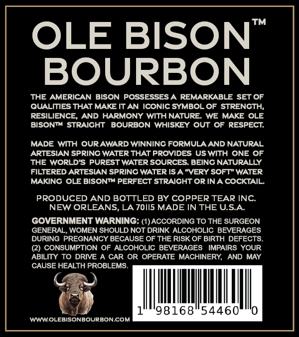
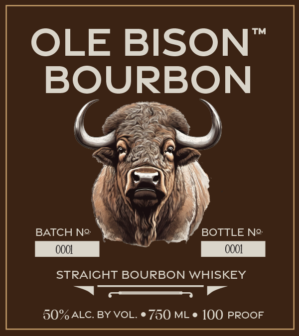
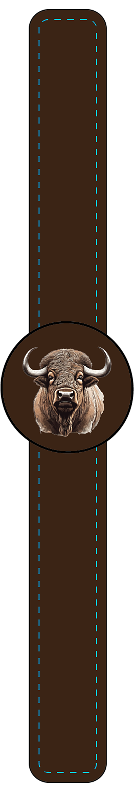

# TTB COLA Label Images - TTBID 24181001000075

**Brand Name:** OLE BISON

**Issue Date:** 07/05/2024

**Origin Code:** 23

**Product Class/Type:** 101

**Source:** [TTB Public COLA Registry](https://ttbonline.gov/colasonline/viewColaDetails.do?action=publicFormDisplay&ttbid=24181001000075)

## Label Images

### Back Label

### Front Label

### Label 2

## Extracted Label Text

*Text extracted via OCR - may contain errors*

*1 image(s) excluded: text did not meet readability threshold*

**Detected Proof:** 100

### Back Label

TM
OLE BISON
BOURBON
THE AMERICAN BISON POSSESSES A REMARKABLE SET OF
QUALITIES THAT MAKE IT AN ICONIC SYMBOL OF STRENGTH,
RESILIENCE
AND HARMONY WITH NATURE
WE MAKE OLE
BISONTM STRAICHT
BOURBON WHISKEY OUT
OF RESPECT
MADE
WITH OURAWARD WINNING FORMULA AND NATURAL
ARTESIAN SPRING WATER THAT PROVIDES US WITH ONE OF
THE WORLD'S PUREST WATER SOURCES BEING NATURALLY
FILTERED ARTESIAN SPRING WATER ISA "VERY SOFT" WATER
MAKING
OLE BISONTM PERFECT STRAICHT OR INA COCKTAIL
PRODUCED AND BOTTLED BY COPPER TEAR INC
NEW ORLEANS, LA 70II5 MADE IN THE USA
GOVERNMENT WARNING: (I)ACCORDING TO THE SURGEON
GENERAL, WOMEN SHOULD NOT DRINK ALCOHOLIC BEVERAGES
DURING PREGNANCY BECAUSE OF THE RISK OF BIRTH DEFECTS
(2) CONSUMPTION OF ALCOHOLIC BEVERAGES
IMPAIRS YOUR
ABILITY TO DRIVE A CAR OR OPERATE MACHINERY
AND MAY
CAUSE HEALTH PROBLEMS
98168"54460
WWWOLEBISONBOURBONCOM

### Front Label

TM
OLE BISON
BOURBON
BATCH No:
BOTTLE No:
OOOL
OOO1
STRAIGHT BOURBON WHISKEY
50%ALC. BY VOL.
750 ML
100 PROOF
