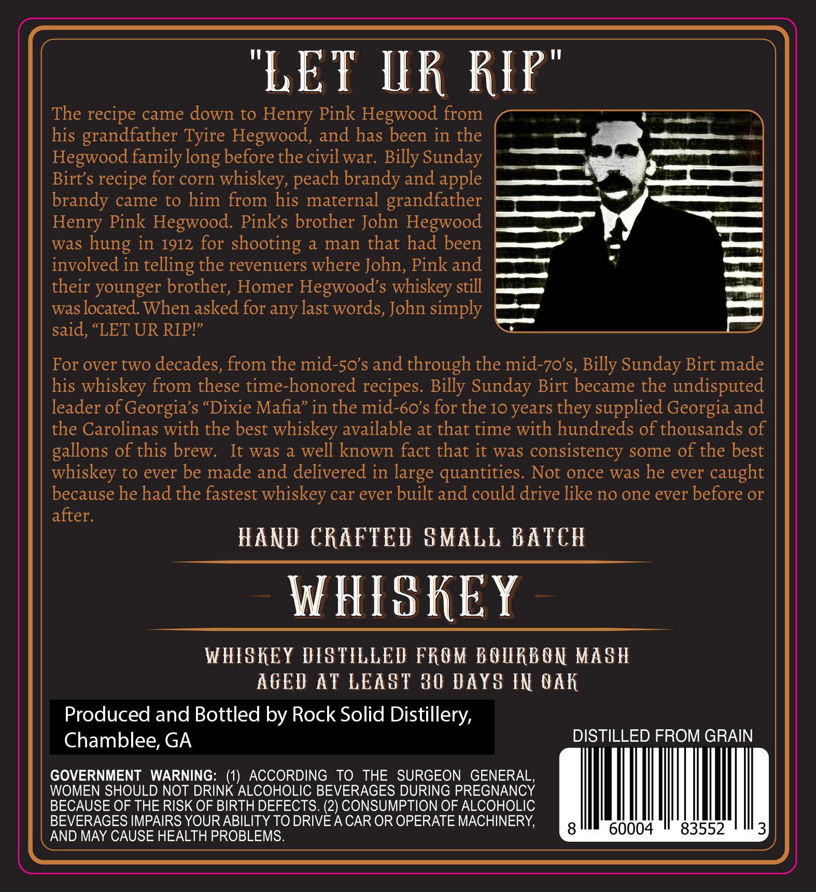
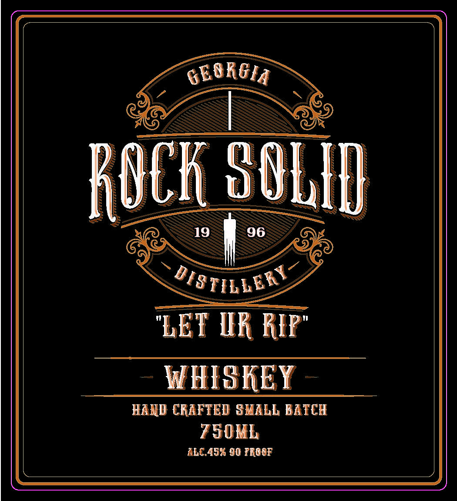

# TTB COLA Label Images - TTBID 24191001000765

**Brand Name:** ROCK SOLID DISTILLERY

**Issue Date:** 07/11/2024

**Origin Code:** 08

**Product Class/Type:** 140

**Source:** [TTB Public COLA Registry](https://ttbonline.gov/colasonline/viewColaDetails.do?action=publicFormDisplay&ttbid=24191001000765)

## Label Images

### Back Label

### Front Label

## Extracted Label Text

*Text extracted via OCR - may contain errors*

**Detected Age:** 10 Years

### Back Label

"LET UR RIR'
The recipe came down to Henry Pink Hegwood from
his grandfather Tyire Hegwood, and has been in the
Hegwood family
before the civil war. Billy Sunday
Birt $
for corn
whiskey,
brandy and apple
brandy came to him from his maternal grandfather
Henry Pink Hegwood. Pinks brother John Hegwood
was
in 1912 for shooting a
man that had been
involved in telling the revenuers where John, Pink and
their younger brother, Homer Hegwoods whiskey
was located. When asked for any last words, John simply
said, "LET UR RIPI"
For over two decades, from the mid-5os and through the mid-70's, Billy Sunday Birt made
his whiskey from these time-honored
Sunday Birt became the undisputed
leader of Georgia s "Dixie Mafia" in the mid-60's for the 10 years
supplied Georgia and
the Carolinas with the best whiskey available at that time with hundreds of thousands of
gallons of this brew.
It was a well known fact that it was consistency some of the best
whiskey to ever be made and delivered in large quantities. Not once was he ever caught
because he had the fastest whiskey car ever built and could drive like no one ever before or
after.
HAND CRAFTED GMALL BATCH
W HISKEY
WHISKEY DISTILLED FROM BOLRB ON MASH
AGED AT LEAST 30 DAYS IN QAK
Produced and Bottled by Rock Solid Distillery,
Chamblee; GA
DISTILLED FROM GRAIN
GOVERNMENT WARNING: (1)
ACCORDING
TO
THE SURGEON
GENERAL,
WOMEN SHOULD NOT DRINK ALCOHOLIC BEVERAGES DURING PREGNANCY
BECAUSE OF THE RISK OF BIRTH DEFECTS. (2) CONSUMPTION OF ALCOHOLIC
BEVERAGES IMPAIRS YOURABILITY TO DRIVEA CAR OR OPERATE MACHINERY,
8
60004
83552
3
AND MAY CAUSE HEALTH PROBLEMS.
long
peach
recipe
hung
still
recipes:
Billy
they

### Front Label

WHISKEY

HAND CRAFTED SMALL BATCH
SOML

ALEASS 90 PROSE
