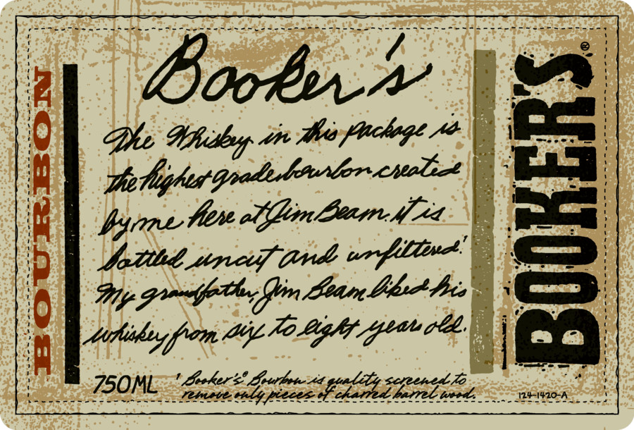
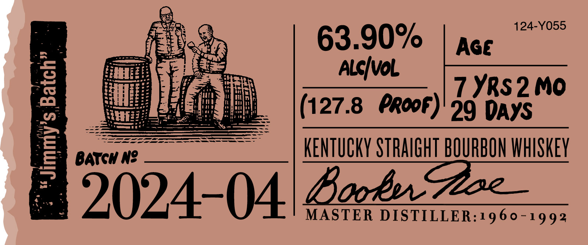

# TTB COLA Label Images - TTBID 24193001000203

**Brand Name:** BOOKER'S

**Issue Date:** 07/11/2024

**Origin Code:** 22

**Product Class/Type:** 101

**Source:** [TTB Public COLA Registry](https://ttbonline.gov/colasonline/viewColaDetails.do?action=publicFormDisplay&ttbid=24193001000203)

## Label Images

### Label 1

### Label 2

### Label 3

### Label 4

## Extracted Label Text

*Text extracted via OCR - may contain errors*

### Label 1

Eee

SEA GES a FN § GR Pa ae REO eee ak pele Oe Fel Se ES.

booker

ws

Puchage Ade

WUilayy are the

ane te Ulin Lagn.Me

ace

betthd sine i

Ip gfe ifn Baan bites ED

fim naan’ | °° |

Laoker? Soutthete xd:

Wa a a is ee tne a i tate ti A i ae

750ML

KK

We1420-7

### Label 2

%)

63.90%

eT

A

EFS

Prey Polat

MEE!

AL¢/VoL

iwi

‘Shee A

ae

(127.8 PROF)

29 Days

\) see 2

SSS eee EEE

SSS Se

Barew We

Zorber STRAIGHT BOURBON WHISKEY

5024-04 chet

### Label 3

BOOKER'S® KENTUCKY STRAIGHT BOURBON WHISKEY

DISTILLED AND BOTTLED BY JAMES B. BEAM DISTILLING CO.

CLERMONT, KENTUCKY

GOVERNMENT WARNING:(1) ACCORDING 10

THE SURGEON GENERAL, WOMEN SHOULD

NOT ORINK ALCOHOLIC BEVERAGES DURING

PREGNANCY BECAUSE

OF THE

AISK

OFBIATH DEFECTS. (2) CONSUMPTION OF

ALCOHOLIC BEVERAGES IMPAIRS YOUR

ABILITY TO DRIVE A CAR OR OPERATE MACHIN

ERY, AND MAY CAUSE HEALTH PROBLEMS

ME VT REF 15¢ ¢ IA REF 5¢

124-Z455-A

### Label 4

»—~
