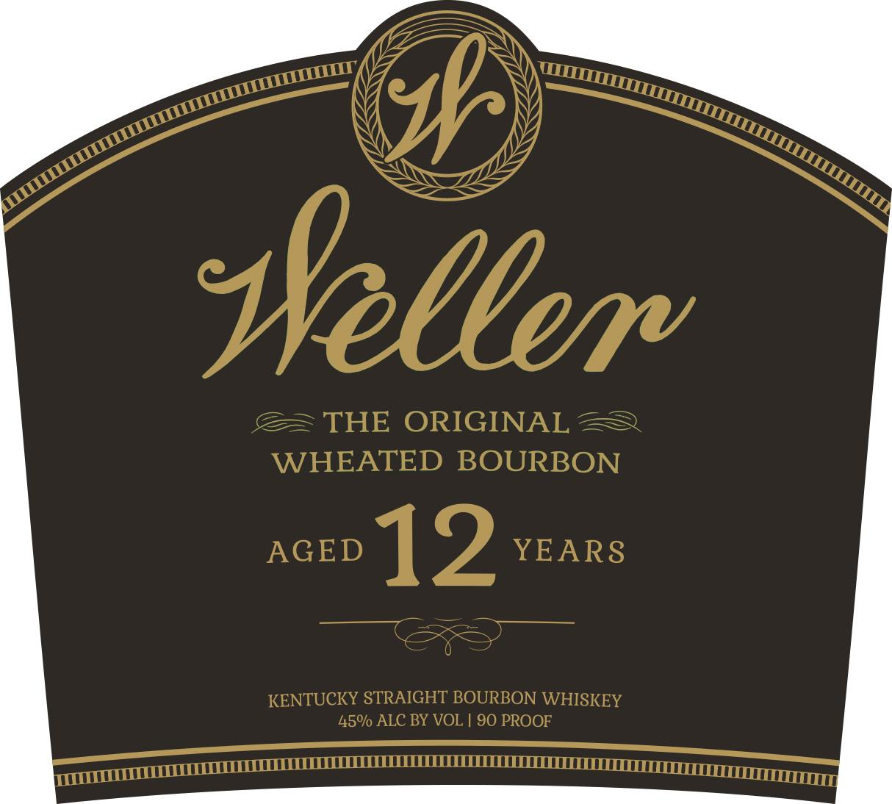
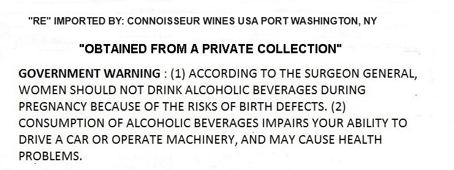

# TTB COLA Label Images - TTBID 24202001000086

**Brand Name:** WELLER

**Fanciful Name:** 12 YEAR OLD

**Issue Date:** 07/23/2024

**Origin Code:** 00

**Product Class/Type:** 101

**Source:** [TTB Public COLA Registry](https://ttbonline.gov/colasonline/viewColaDetails.do?action=publicFormDisplay&ttbid=24202001000086)

## Label Images

### Label 1

### Label 2

## Extracted Label Text

*Text extracted via OCR - may contain errors*

### Label 1

pr

\)

ss

SS

\

SS

Ss

M7

oor ~ <we

@= THE ORIGINAL 2

WHEATED BOURBON

_ | 2 YEARS

KENTUCKY STRAIGHT BOURBON WHISKEY

45% ALC BY VOL | 90 PROOF

Witt

semeeeeeeTTTTC TT CCCI CLLEULLLLUO ULLAL LULL LLLLUCLOGUE COSTCO Tne

### Label 2

“RE" IMPORTED BY: CONNOISSEUR WINES USA PORT WASHINGTON, NY

“OBTAINED FROM A PRIVATE COLLECTION"

GOVERNMENT WARNING : (1) ACCORDING TO THE SURGEON GENERAL,

WOMEN SHOULD NOT DRINK ALCOHOLIC BEVERAGES DURING

PREGNANCY BECAUSE OF THE RISKS OF BIRTH DEFECTS. (2)

CONSUMPTION OF ALCOHOLIC BEVERAGES IMPAIRS YOUR ABILITY TO

DRIVE A CAR OR OPERATE MACHINERY, AND MAY CAUSE HEALTH

PROBLEMS.
