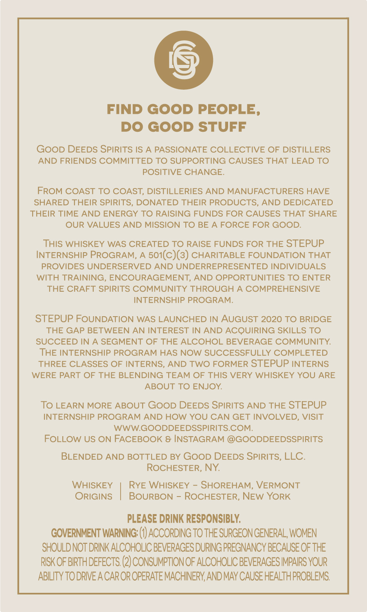
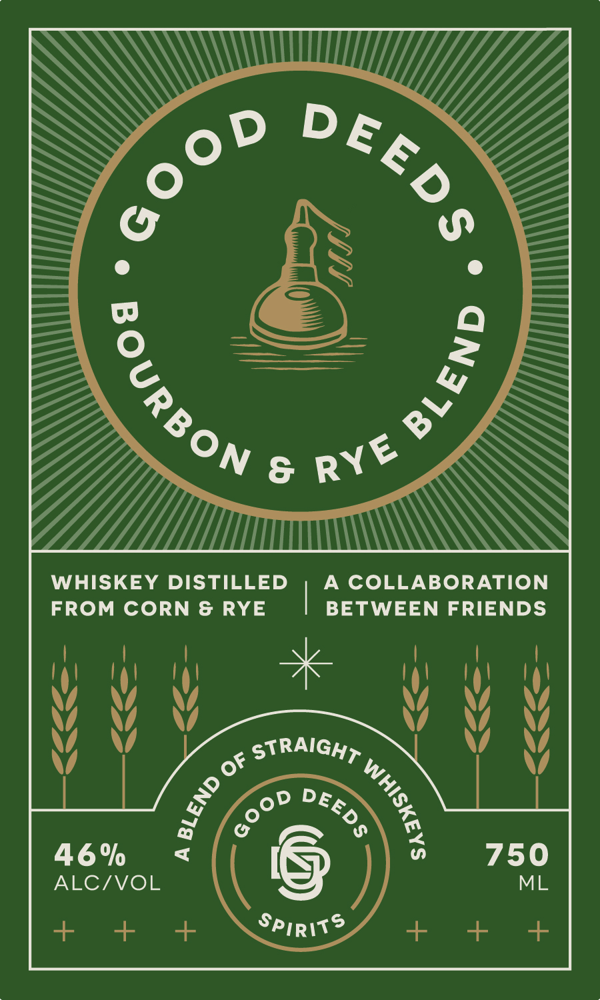

# TTB COLA Label Images - TTBID 24275001000142

**Brand Name:** GOOD DEEDS SPIRITS

**Issue Date:** 10/04/2024

**Origin Code:** 02

**Product Class/Type:** 129

**Source:** [TTB Public COLA Registry](https://ttbonline.gov/colasonline/viewColaDetails.do?action=publicFormDisplay&ttbid=24275001000142)

## Label Images

### Back Label

### Front Label

## Extracted Label Text

*Text extracted via OCR - may contain errors*

**Detected Proof:** 92

### Back Label

FIND GOOD PEOPLE,
DO GOOD STUFF
GOoD DEEDS SPIRITS IS
A PASSIONATE COLLECTIVE OF DISTILLERS
AND FRIENDS COMMITTED TO SUPPORTING CAUSES THAT LEAD TO
POSITIVE CHANGE
FROM COAST TO COAST, DISTILLERIES AND MANUFACTURERS HAVE
SHARED THEIR SPIRITS
DONATED THEIR PRODUCTS
AND DEDICATED
THEIR TIME AND ENERGY TO RAISING FUNDS FOR CAUSES THAT SHARE
OUR VALUES AND MISSION TO BE
A FORCE FOR GOOD.
THIS WHISKEY WAS CREATED TO RAISE FUNDS FOR THE STEPUP
INTERNSHIP PROGRAM,
501(c)(3) CHARITABLE FOUNDATION THAT
PROVIDES UNDERSERVED AND UNDERREPRESENTED INDIVIDUALS
WITH TRAINING, ENCOURAGEMENT, AND OPPORTUNITIES TO ENTER
THE CRAFT SPIRITS COMMUNITY THROUGH
A COMPREHENSIVE
INTERNSHIP PROGRAM:
STEPUP FOUNDATION WAS LAUNCHED IN AUGUST 2020 TO BRIDGE
THE GAP BETWEEN AN INTEREST IN AND ACQUIRING SKILLS TO
SUCCEED IN
A SEGMENT OF THE ALCOHOL BEVERAGE COMMUNITY
THE INTERNSHIP PROGRAM HAS NOW SUCCESSFULLY COMPLETED
THREE CLASSES OF INTERNS, AND TWO FORMER STEPUP INTERNS
WERE PART OF THE BLENDING TEAM OF THIS VERY WHISKEY YOU ARE
ABOUT TO ENJOY
To LEARN MORE ABOUT GOoD DEEDS SPIRITS AND THE STEPUP
INTERNSHIP PROGRAM AND HOW YOU CAN GET INVOLVED; VISIT
WWWGOODDEEDSSPIRITS.COM:
FOLLOW US ON FACEBOOK & INSTAGRAM @GOODDEEDSSPIRITS
BLENDED AND BOTTLED BY GOOD DEEDS SPIRITS, LLC.
ROCHESTER, NY
WHISKEY
RYE WHISKEY
SHOREHAM; VERMONT
ORIGINS
BOURBON
ROCHESTER, NEw YORK
PLEASE DRINK RESPONSIBLY
GOVERNMENT WARNING:
ACCORDING TO THE SURGEON GENERAL, WOMEN
SHOULDNOT DRINK ALCOHOLIC BEVERAGES DURING PREGNANCY BECAUSE OF THE
RISK OF BIRTH DEFECTS: (2) CONSUMPTIONOF ALCOHOLIC BEVERAGES IMPAIRS YOUR
ABILITY TO DRIVE A CAR OR OPERATEMACHINERY, AND MAY CAUSE HEALTHPROBLEMS:

### Front Label

8
WHISKEY
DISTILLED
A
COLLABORATION
FROM CORN & RYE
BETWEEN FRIENDS
of STRAIGHT _
46%
7
750
ALCIVOL
ML
+
+
Spirits
DEED$
Go0D
(
9
RYE
1
3
DEEDs_
8
