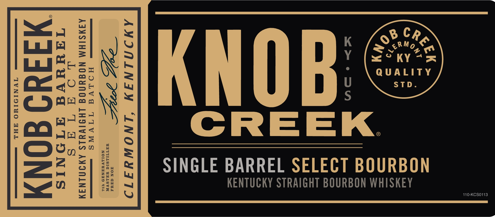
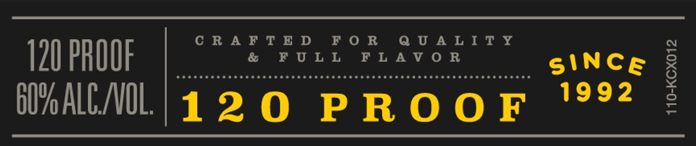
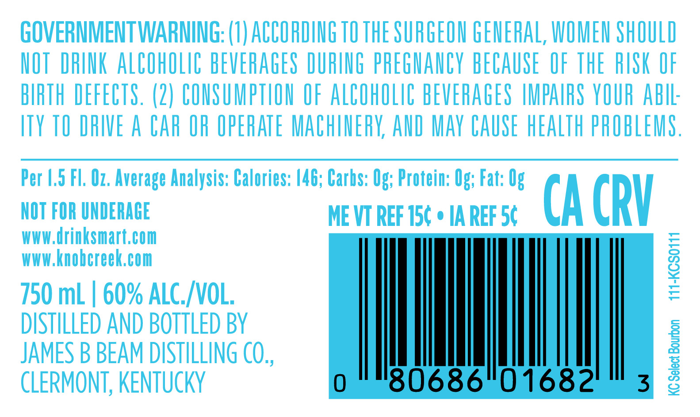

# TTB COLA Label Images - TTBID 24290001000166

**Brand Name:** KNOB CREEK

**Issue Date:** 10/17/2024

**Origin Code:** 22

**Product Class/Type:** 101

**Source:** [TTB Public COLA Registry](https://ttbonline.gov/colasonline/viewColaDetails.do?action=publicFormDisplay&ttbid=24290001000166)

## Label Images

### Label 1

### Label 2

### Label 3

### Label 4

## Extracted Label Text

*Text extracted via OCR - may contain errors*

*3 image(s) excluded: text did not meet readability threshold*

**Detected Proof:** 120

### Label 3

GOVERNMENTWARNING: (8) ACCOHDING TO THE SURGEON GENERAL, WOMEN ShOULD
HOT  DRINK ALCOhOLIC BEVERAGES DURIUG pREGHaNCY BECAUSE   OF THE RISK OF
BIRTH DEFECTS. (2) CONSUMPTLOU OF ALCOhOLIC BEVERAGES IMPAIRS VOUR AbIL:
ITY TO DRIVE A CAr OR OPERATE MAChINERK; AND Mav CAUSE hEALTh PROBLEMS ,
Per |.,5 Fl. Oz. Average Analysis: Calories: 146; Carbs: Og; Protein: Og; Fat: Og
NOT FOR UNDERACE
ME VT REF 15c
IA REF 54
CA CRV
wwW drinksmart,com
wwW knobcreek,com
1
750 mL
60% ALC_ VOL;
DISTILLED AND BOTTLED BY
JAMES B BEAM DISTILLING CO,,
J
CLERMONT, KENTUCKY
80686"01682
3
