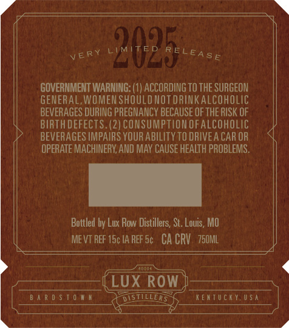
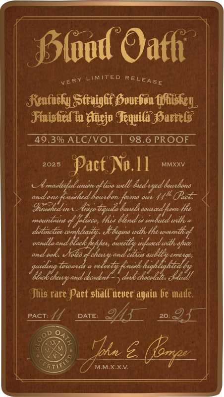
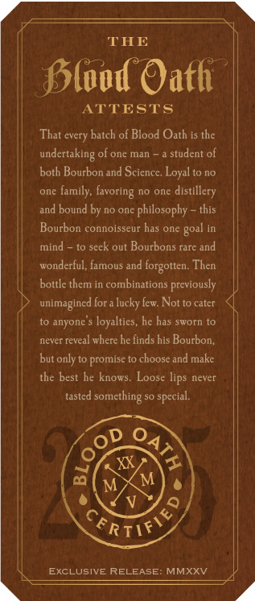

# TTB COLA Label Images - TTBID 24303001000381

**Brand Name:** BLOOD OATH

**Fanciful Name:** PACT 11

**Issue Date:** 10/30/2024

**Origin Code:** 29

**Product Class/Type:** 641

**Source:** [TTB Public COLA Registry](https://ttbonline.gov/colasonline/viewColaDetails.do?action=publicFormDisplay&ttbid=24303001000381)

## Label Images

### Back Label

### Front Label

### Label 3

### Label 4

### Label 5

## Extracted Label Text

*Text extracted via OCR - may contain errors*

*2 image(s) excluded: text did not meet readability threshold*

### Back Label

——————
ery LIMITED RELE gg,
GOVERNMENT WARNING: (1) ACCORDING TO THE SURGEON
GENERAL, WOMEN SHOULD NOTORINKALCOHOLIC
BEVERAGES DURING PREGNANCY BECAUSE OF THE RISK OF
BIRTH DEFECTS. (2) CONSUMPTION OF ALCOHOLIC
P BEVERAGES IMPAIRS YOURABILITYTODRIVEACAROR © <
OPERATE MACHINERY, AND MAY CAUSE HEALTH PROBLEMS.
Bottled by Lux Row Distillers, St. Louis, MO
MEVTREF 1c 1AREFS¢ CACRV. 750M
a 4
{LUX ROW
DARDS TOWN -Q>RISTILLERSHENTUCHTLUSA
PAU SAO eae os ITS EY
Wifes eed si Bt tr BR ae RM: toga 22 CULAR SO yea are ee

### Front Label

| Ptood Oath
Plot Oath
| Sontaiby Stiaight Bourhin idhey.
| Finished in Aaejo Tequila, Harrels
TADBGALCIVOL 1 98.6 PROOF ||
2025 Pact No.l! MMxxv
1 hanacilal aint sell Maclay heals
» aE TITS 7
| Fiche n Mepotigule hauls socrd fom He
macau is Und tind wth
| itn nhl, Keg ith oronitel
eared nil isa withyhn
| ze seed,
| Uidligwiica. EET
| This rare Pact sfiall'tever again be made.
pees Poe enmicra)
; re
_ g
| SY C/ winix.xn

### Label 3

<

THE

Alood Oath

ATTESTS

That every batch of Blood Oath is the

undertaking of one man ~ a student of

both Bourbon and Science, Loyal tno

one family, favoring no one distillery

||

and bound by no one philosophy ~ this

Bourbon connoisseur has one goal in

mind — to seek out Bourbons rare and

||

wonderful, famous and forgotten. Then

bottle them in combinations previously

unlimagined fora lucky few. Not to cater

to anyone's loyalties, he has sworn to

never reveal where he finds his Bourbon,

but only to promise to choose and make

the best he knows, Loose lips never

tasted something so special.

ws

we

ERIE

\\_ exctusive RELEASE: MMXXV

»

g
