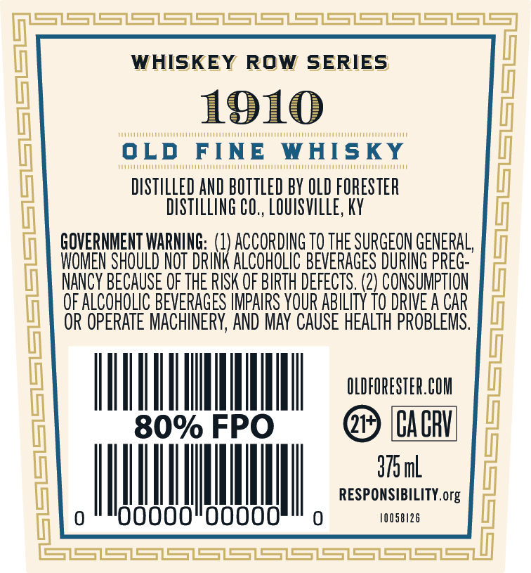
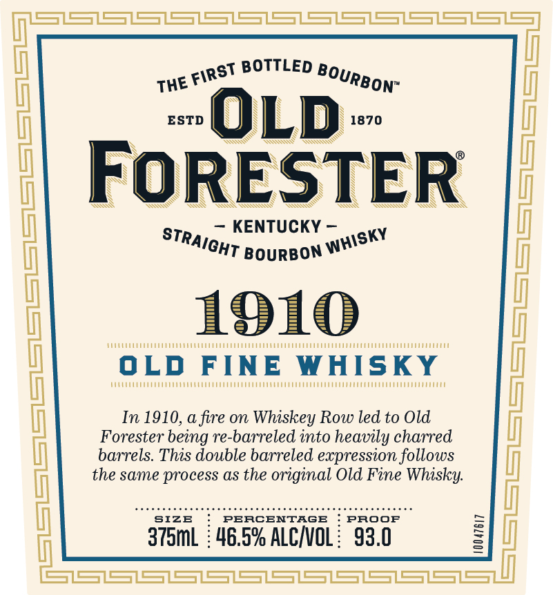
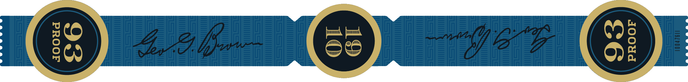

# TTB COLA Label Images - TTBID 24305001000147

**Brand Name:** OLD FORESTER

**Fanciful Name:** 1910 OLD FINE

**Issue Date:** 11/04/2024

**Origin Code:** 22

**Product Class/Type:** 101

**Source:** [TTB Public COLA Registry](https://ttbonline.gov/colasonline/viewColaDetails.do?action=publicFormDisplay&ttbid=24305001000147)

## Label Images

### Back Label

### Front Label

### Label 3

## Extracted Label Text

*Text extracted via OCR - may contain errors*

### Back Label

Ce er ee SS eS eS SS SS eS ee SSS

WHISKEY ROW SERIES

1910

OLD FINE WHISKY

‘DISTILLED AND BOTTLED BY OLD FORESTER

DISTILLING CO., LOUISVILLE, KY

GOVERNMENT WARNING: (

ACCORDING T0 THE SURGEON GENERAL,

OMEN SHOULD NOT DRIN

(

ALCOHOLIC BEVERAGES DURING PREG-

NANCY BECAUSE OF THE RISK OF BIRTH DEFECTS. (2) CONSUMPTION

OF ALCOHOLIC BEVERAGES IMPAIRS YOUR ABILITY 10 DRIVE A CAR

OR OPERATE MACHINERY, AND MAY CAUSE HEALTH PROBLEMS

HH OLDFORESTER.COM

Nu

@> (CACHI

dom

HHI

|

|

RESPONSIBILITY. org

lI

00000

|

00000

0

10058126

SS ss

### Front Label

TH

ast BOTTLED Boy,

ON”

ESTD

1870

L

AS

SS

q

RN

SS

WS

sy

¥

NY

SA

— KENTUCKY —

KY

STr, "

CHT Bourson W™

1910

VCO UE ern nee eerie ieee

ieee tere lt eG

ty ruurrnnnnenenniey

svvuunnttnt

Hunn

In 1910, a fire on Whiskey Row led to Old

Forester being re-barreled into heavily charred

barrels. This double barreled expression follows

the same process as the original Old Fine Whisky.

SIZE

PERCENTAGE ! PROOF

375mL : 46.5% ALC/VOL: 93.0

<j | a ee i)

### Label 3

OF MESS /-S—
