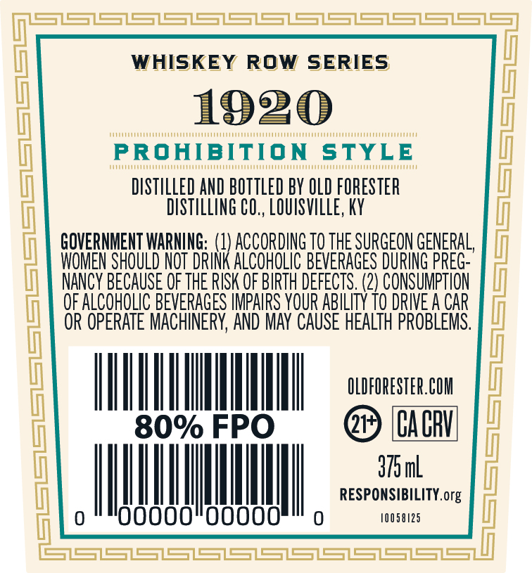
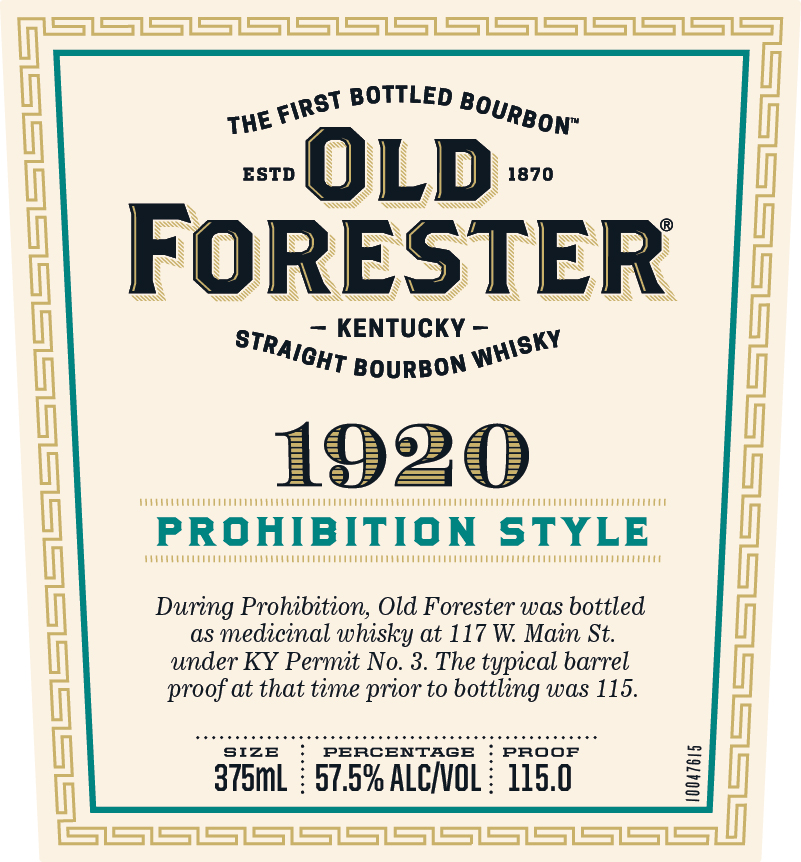
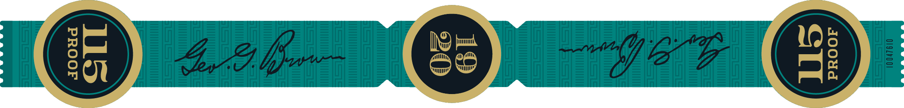

# TTB COLA Label Images - TTBID 24305001000157

**Brand Name:** OLD FORESTER

**Fanciful Name:** 1920 PROHIBITION STYLE

**Issue Date:** 11/06/2024

**Origin Code:** 22

**Product Class/Type:** 101

**Source:** [TTB Public COLA Registry](https://ttbonline.gov/colasonline/viewColaDetails.do?action=publicFormDisplay&ttbid=24305001000157)

## Label Images

### Back Label

### Front Label

### Label 3

## Extracted Label Text

*Text extracted via OCR - may contain errors*

### Back Label

i ee S| a eS eS eS eS eS ee SSS

WHISKEY ROW SERIES

1920

PROHIBITION STYLE

DISTILLED AND BOTTLED BY OLD FORESTER

DISTILLING CO., LOUISVILLE, KY

GOVERNMENT WARNING: (

ACCORDING T0 THE SURGEON GENERAL,

OMEN SHOULD NOT DRIN

(

ALCOHOLIC BEVERAGES DURING PREG-

NANCY BECAUSE OF THE RISK OF BIRTH DEFECTS. (2) CONSUMPTION

OF ALCOHOLIC BEVERAGES IMPAIRS YOUR ABILITY 10 DRIVE A CAR

OR OPERATE MACHINERY, AND MAY CAUSE HEALTH PROBLEMS

Ih OLDFORESTER.COM

Nu

@> (CACHI

dom

HHI

|

|

RESPONSIBILITY. org

lI

00000

|

00000

0

10058125

ss

### Front Label

THEE

ans BOTTLED Boy,

ESTD

1870

N

Sy

g

SS

SN

Y

~

ay

=A

— KENTUCKY —

KY

STr, "

CHT Bourson 8

1920

wie

1

Me

venue

Humaine

PROHIBITION STYLE

Mn

During Prohibition, Old Forester was bottled

as medicinal whisky at 117 W. Main St.

under KY Permit No. 3. The typical barrel

proof at that time prior to bottling was 115.

ARR REAR ENORRANEAREPIRSERIATEREARSROnEEEEREGERAEDAN

SIZE

PERCENTAGE

i PROOF

375mL : 57.5% ALC/VOL : 115.0

a ee i)

### Label 3

GSS
