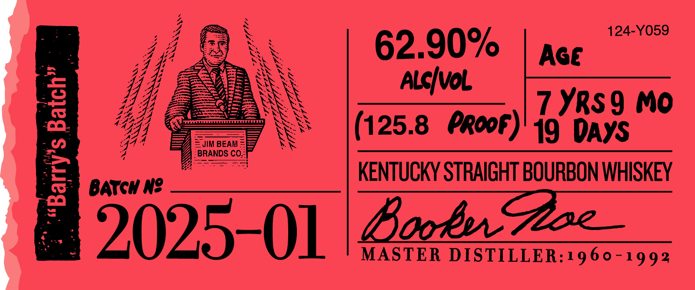
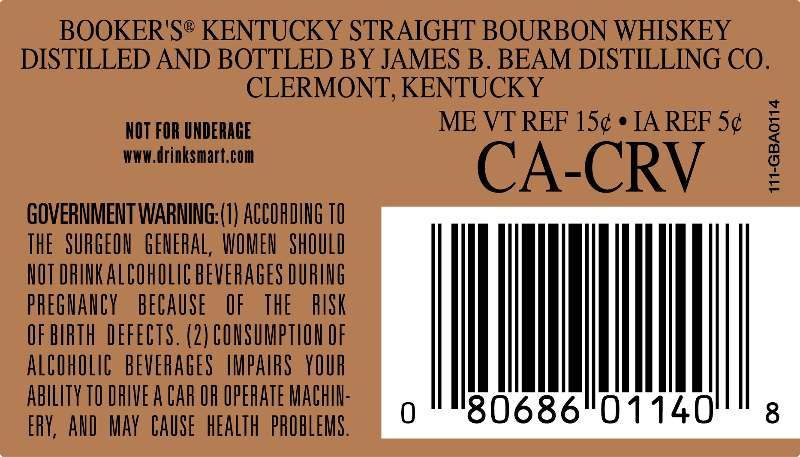

# TTB COLA Label Images - TTBID 24320001000063

**Brand Name:** BOOKER'S

**Issue Date:** 11/18/2024

**Origin Code:** 22

**Product Class/Type:** 101

**Source:** [TTB Public COLA Registry](https://ttbonline.gov/colasonline/viewColaDetails.do?action=publicFormDisplay&ttbid=24320001000063)

## Label Images

### Label 1

### Label 2

### Label 3

### Label 4

## Extracted Label Text

*Text extracted via OCR - may contain errors*

*1 image(s) excluded: text did not meet readability threshold*

### Label 1

Boob

De Whiithyy ste thes plochege 0

—_

polighes

one Hire offlim Learn ifr

pica

Sotihd wipers (rds un f Line

Gy gmt, in Lean bh heis

Mtiihiy from Ai 70 Ligh Geen

=<

aE Sse

### Label 2

LEE

es

aS

62.90%

ZA

a

Gers

44

vy,

=

=o

ISN

14444

“G44

VSS Se

(125.8 PRooF)

19 DAYS

a

el

“Ys BRANDS C Co.

SS

Bord STRAIGHT BOURBON WHISKEY

Barew WN? —_

5025-01 lee

### Label 3

BOOKER'S® KENTUCKY STRAIGHT BOURBON WHISKEY

DISTILLED AND BOTTLED BY JAMES B. BEAM DISTILLING CO.

CLERMONT, KENTUCKY

NOT FOR UNDERAGE

ME VT REF 15¢ ¢ IA REF 5¢

WWW.drinksmart.com

CA-CRV

GOVERNMENT WARNING:(1) ACCORDING 10

meme weenie

THE SURGEON GENERAL, WOMEN SHOULD

NOT DRINK ALCOHOLIC BEVERAGES DURING

PREGNANCY BECAUSE OF THE

RISK

OF BIRTH DEFECTS. (2) CONSUMPTION OF

ALCOHOLIC BEVERAGES IMPAIRS YOUR

ABILITY TO DRIVE A CAR OF OPERATE MACHIN

ERY, AND MAY CAUSE HEALTH PROBLEMS
