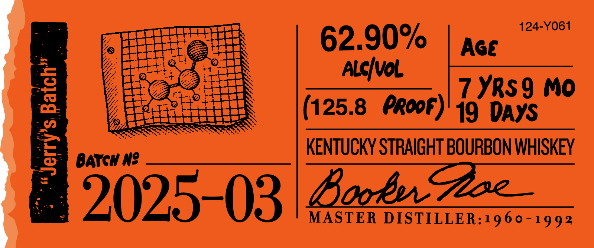

# TTB COLA Label Images - TTBID 24320001000072

**Brand Name:** BOOKER'S

**Issue Date:** 11/18/2024

**Origin Code:** 22

**Product Class/Type:** 101

**Source:** [TTB Public COLA Registry](https://ttbonline.gov/colasonline/viewColaDetails.do?action=publicFormDisplay&ttbid=24320001000072)

## Label Images

### Label 1

### Label 2

### Label 3

### Label 4

## Extracted Label Text

*Text extracted via OCR - may contain errors*

*1 image(s) excluded: text did not meet readability threshold*

**Detected Proof:** 125.8

### Label 1

BBokeh
@e
w Hlo packaqe /
Tdlahut oradekuNeor-cxeabz
1
"@a tonzeandro
1
my I-dathfmm Zoam /sys hto
whukeyfrom duiz %o eigrt _
022,
Z5OML
Eoker?? Sburbon24
"falztuitren
%
remabl
snly pieces
bssL
124-1420-A
IRibt -
LrpaLlxce'
~Eea _

### Label 2

124-Y061
62.90%
Age
Alqivol
1
7 YRs9 Mo
125.8
eropf)' 19
DAYS
5
BATGH N?
KENTUCKY STRAIGHT BOURBON WHISKEY
2025-03
BooEQoe
MASTER
DISTILLER:1960-1992

### Label 3

BOOKER'SS
KENTUCKY STRAIGHT BOURBON WHISKEY
DISTILLED AND BOTTLED BY JAMES B. BEAM DISTILLING CO.
CLERMONT, KENTUCKY
NOT FOR UNDERAGE
ME VT REF 154
IA REF 54
WWW drinksmart,com
CA-CRV
1
GOVERNMENT WARNING: (I) ACCORDIUG TO
THE   SURGEOU  GENERAL, WOMEN  ShOULI
NOT DRINKALCOhOLICBEVERAGES DURIUG
pREGUaUEY
BECAUSE
OF
THE
RISK
OF BIRTH  defects. (2) CONSUMPTLOU OF
alcohOlic   BEVERAGES   |mpAIbS   YOUR
abiliTy TO IRIVE A CAR OR OPERATE Machi:
'80686"001140'
8
ERV, ANI May CAUSe   hEAlTh  PROBLEMS.
