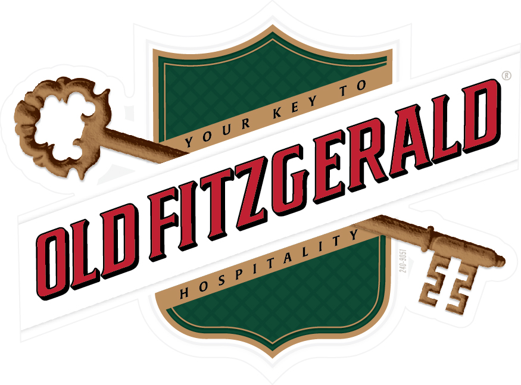
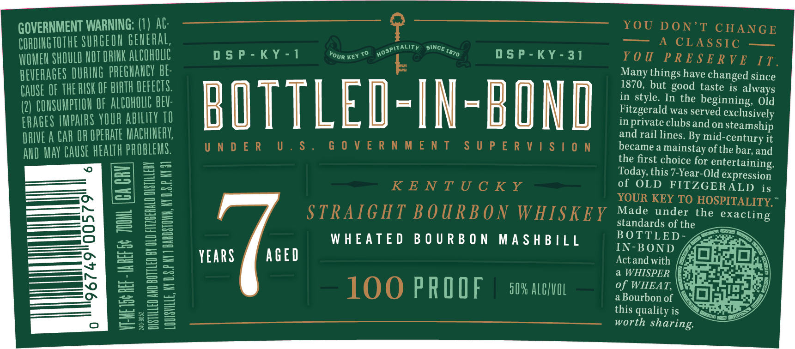
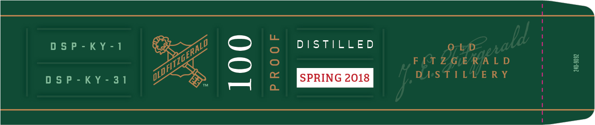

# TTB COLA Label Images - TTBID 24324001000478

**Brand Name:** OLD FITZGERALD

**Issue Date:** 11/20/2024

**Origin Code:** 22

**Product Class/Type:** 101

**Source:** [TTB Public COLA Registry](https://ttbonline.gov/colasonline/viewColaDetails.do?action=publicFormDisplay&ttbid=24324001000478)

## Label Images

### Label 1

### Label 2

### Label 3

## Extracted Label Text

*Text extracted via OCR - may contain errors*

*1 image(s) excluded: text did not meet readability threshold*

### Label 2

— YOU DON’T CHANGE
GOVERNMENT WARNING: 4 AC]. —o-ooa—-§oéo c——

ae CLASSIC e——
CORDINGTOTHE SURGEON GENERAL

vo. oot tALIT Otay DSP-KY-31 YOU PRESERVE 11.
WOMEN SHOULD NOT DRINK ALCOHOLIC DSP-KY-1 Youn xe

Many things have changed since
BEVERAGES DURING PREGNANCY BE-

k 1870, but good taste is always

in style. I he beginning, Old

CAUSE OF THE RISK OF IRTH DEFECTS. = = Fitegrrald wos served exclusively

(2) CONSUMPTION Of ALCOHOLIC BEY: in private clubs and on steamship
ERAGES IMPAIRS YOUR ABILITY TO

and rail lines. By mid-century it

ION became a mainstay of the bar, and

DRIVE A CAR i Hae ae UNDER U.S. SON ETN ENTIRE S UST RESR VAISS G the first choice for entertaining.
AND MAY CAUSE HEALTH PROB D Today, this 7-Year-Old expression
of OLD FITZGERALD is
KETENT AY GUIS Ne YOUR KEY TO HOSPITALITY.”

STRAIGHT BOURBON WHISKEY Made under the exacting

standards of the 2
BOTTLED- gan.
WHEATED BOURBON MASHBILL IN-BOND (gripe
0 Actand with /47}— 01) 7
YEARS @ AGE See (Esae
LOO PROOF sovmcwn = ef waear, Netra sae
this quality is gt
worth sharing.

~o

96749'00579

0

### Label 3

—)

DS ais EID)

O71e/D:

FIT 2G ERJA LD

=)

DiS) PEK years

ph

Des TITLE RY

ge

ee

[SPRING 2018
