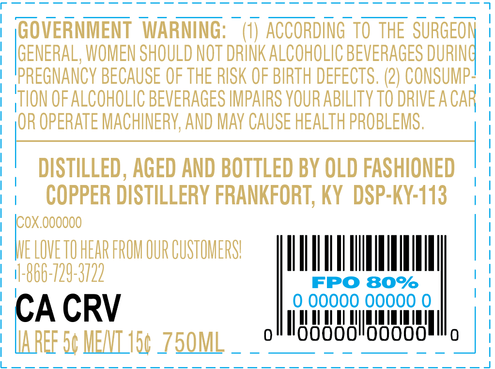
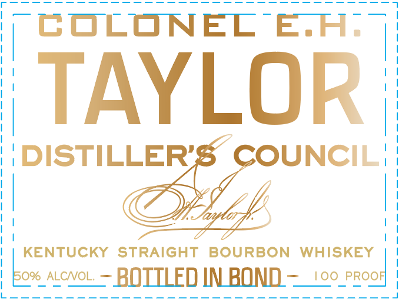

# TTB COLA Label Images - TTBID 24339001000343

**Brand Name:** COLONEL E.H. TAYLOR

**Fanciful Name:** DISTILLER'S COUNCIL

**Issue Date:** 12/10/2024

**Origin Code:** 22

**Product Class/Type:** 119

**Source:** [TTB Public COLA Registry](https://ttbonline.gov/colasonline/viewColaDetails.do?action=publicFormDisplay&ttbid=24339001000343)

## Label Images

### Back Label

### Front Label

## Extracted Label Text

*Text extracted via OCR - may contain errors*

### Back Label

Se Ee eS Mes

(GOVERNMENT WARNING:

(1) ACCORDING TO THE SURGEON

GENERAL, WOMEN SHOULD NOT DRINK ALCOHOLIC BEVERAGES DURIN

|

PREGNANCY BECAUSE OF THE RISK OF BIRTH DEFECTS. (2) CONSUMP-

TION OF ALCOHOLIC BEVERAGES IMPAIRS YOUR ABILITY TO DRIVE ACA

OR OPERATE MACHINERY, AND MAY CAUSE HEALTH PROBLEMS.

DISTILLED, AGED AND BOTTLED BY OLD FASHIONED

COPPER DISTILLERY FRANKFORT, KY DSP-KY-113

\COX.000000

OVETO REAR FROM OUR CUSTOMERS!

VAN

CA CRV

All

00000

Il rT i i ll

i

TUT

00000

Ill,

IAREE S¢ MEAT 15¢ 7 5OML

### Front Label

ET

COLONEL €E.H.

TAYLOR
Oe |

KENTUCKY STRAIGHT BOURBON WHISKEY

Bor ALCwol. — BOTTLED IN BOND —_'00 Peooy

Le
