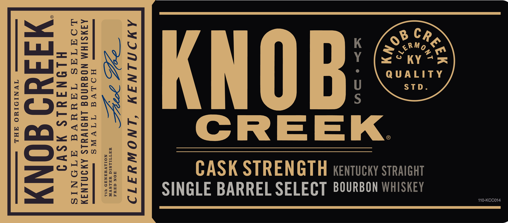
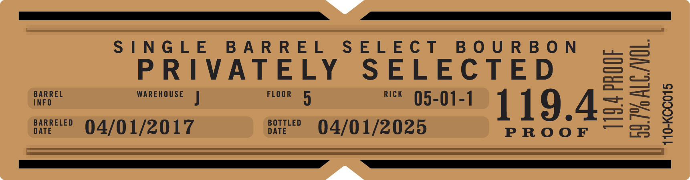
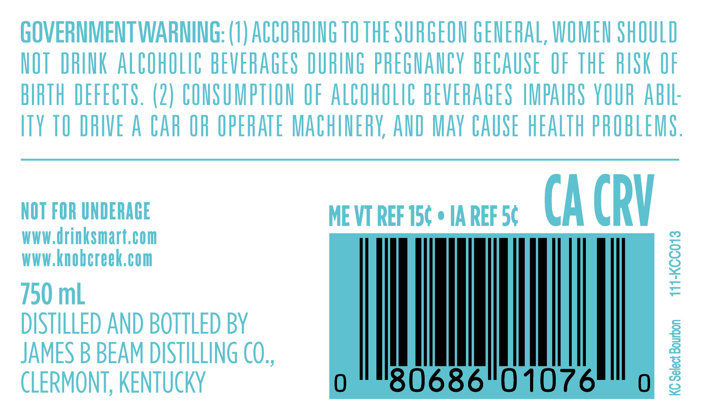
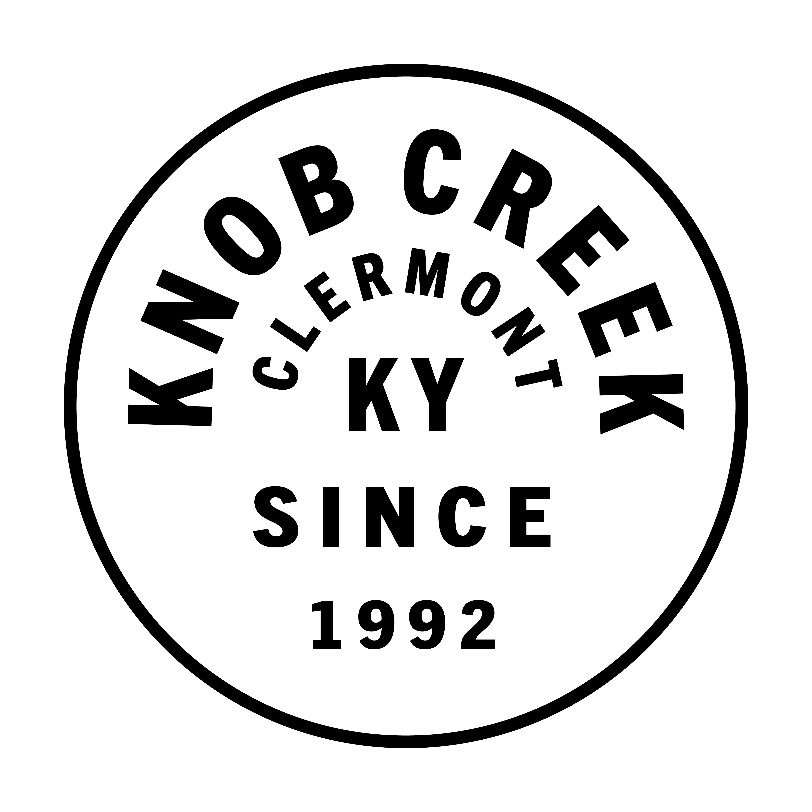

# TTB COLA Label Images - TTBID 24353001000397

**Brand Name:** KNOB CREEK

**Issue Date:** 12/20/2024

**Origin Code:** 22

**Product Class/Type:** 101

**Source:** [TTB Public COLA Registry](https://ttbonline.gov/colasonline/viewColaDetails.do?action=publicFormDisplay&ttbid=24353001000397)

## Label Images

### Label 1

### Label 2

### Label 3

### Label 4

## Extracted Label Text

*Text extracted via OCR - may contain errors*

*2 image(s) excluded: text did not meet readability threshold*

### Label 1

110-KCC014

CASK STRENGTH kentucky straigut
SINGLE BARREL SELECT B80URBON WHISKEY

AMINLINIM ‘INOWHYITI

LA WG
HOLVGA TIVNS
AAMSIHM NOGUNOE LHIIVYLS AWININAY

LOATAS TAUHUVA ATIONIS

HLINIJULS WSVI

Miid0 4ONy

IVNIOIWUO AHL

### Label 2

DS

SINGLE BARREL SELECT BOURBON

—_ —«C—

PRIVATELY SELECTED

INF

BARREL

WAREHOUSE J

FLOOR 5

Qa. —!

"« 05-01-1 1 19.4

ost

oe ©<04/01/2017

DATE

BOTTLED

04/01/2025

PROOF

— oo

ll
