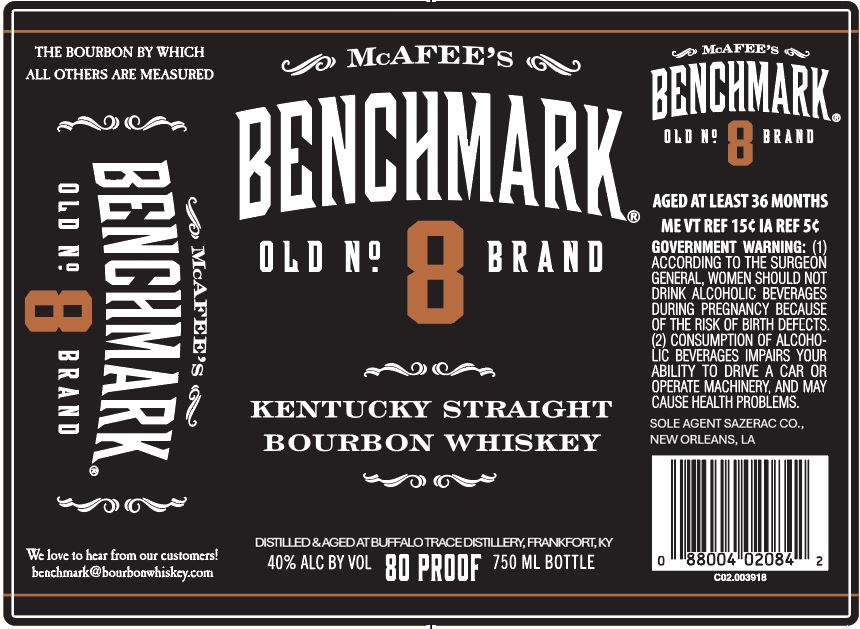

# TTB COLA Label Images - TTBID 25006001000265

**Brand Name:** BENCHMARK

**Issue Date:** 01/07/2025

**Origin Code:** 23

**Product Class/Type:** 101

**Source:** [TTB Public COLA Registry](https://ttbonline.gov/colasonline/viewColaDetails.do?action=publicFormDisplay&ttbid=25006001000265)

## Label Images

### Label 1

## Extracted Label Text

*Text extracted via OCR - may contain errors*

### Label 1

THE BOURBON BY WHICH

<f McAFEE’s ay,

ALL OTHERS ARE MEASURED.

cg@ McAFEE’s qq»

BENCHNARK,

RRDICSS

now a BRAND

AGED AT LEAST 36 MONTHS

BENCHMARK

MEVT REF 15¢ 1A REF 5¢

ACCORDING TO THE SURGEON

GOVERNMENT WARNING: (1)

OLD N?

BRAND

‘N SHOULD NOT

GRIN ALCOHOL

ILIC BEVERAGES

DURING PREGNANCY BECAUSE

= ——

OF THE RISK OF BIRTH DEFECTS.

(2) CONSUMPTION OF ALCOHO-

eaDCHs,

ABILITY TO DRIVE A CAR OR

YOUR

OPERATE MACHINERY, AND MAY

CAUSE HEALTH PROBLEMS.

KENTUCKY STRAIGHT

‘SOLE AGENT SAZERAC CO.

NEW ORLEANS, LA,

BOURBON WHISKEY

0 OS”

OS”

DISTILLED & AGED AT BUFFALO TRACE DISTILLERY, FRANKFORT, KY

‘We love to hear from our customers!

0

'88004°02084"

beachinark@bourbonwhiskey.com

40% ALC BY VOL 80 PROOF 750 ML BOTTLE

‘coz003e18
