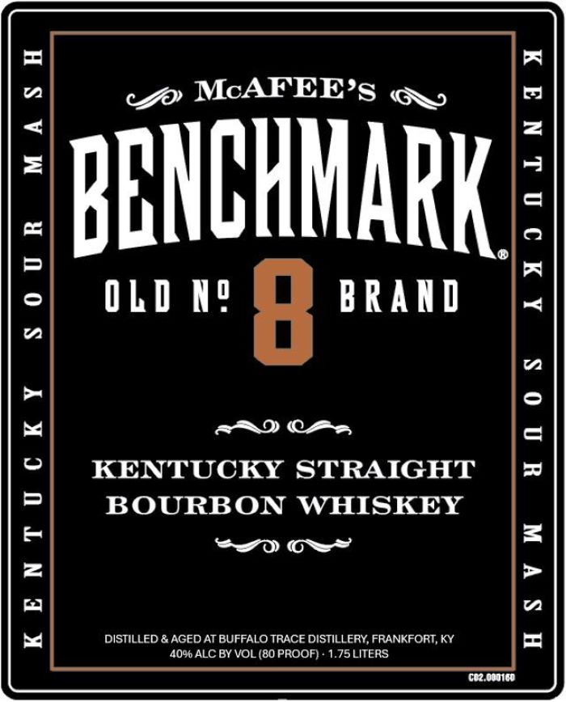
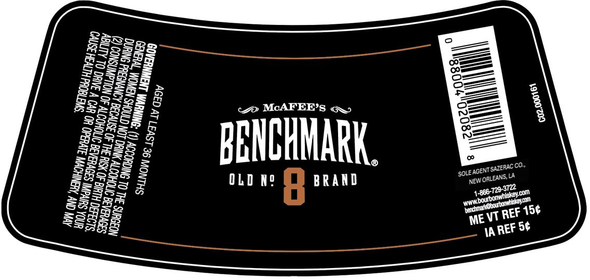

# TTB COLA Label Images - TTBID 25006001000268

**Brand Name:** BENCHMARK

**Issue Date:** 01/07/2025

**Origin Code:** 23

**Product Class/Type:** 101

**Source:** [TTB Public COLA Registry](https://ttbonline.gov/colasonline/viewColaDetails.do?action=publicFormDisplay&ttbid=25006001000268)

## Label Images

### Label 1

### Label 2

## Extracted Label Text

*Text extracted via OCR - may contain errors*

*1 image(s) excluded: text did not meet readability threshold*

### Label 1

cc McAFEE’s qq,

ENCHMARK

OLD "f BRAND

MASH
SErETES

=I
i=}
o
“a

eRD CAs,
KENTUCKY STRAIGHT
BOURBON WHISKEY
29 OS”

unos

KENTUCKY
HS VW

DISTILLED & AGED AT BUFFALO TRACE DISTILLERY, FRANKFORT, KY
40% ALC BY VOL (80 PROOF) - 1.75 LITERS
