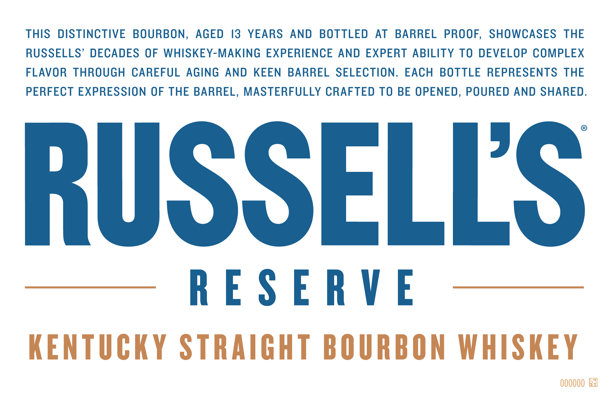
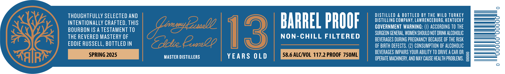
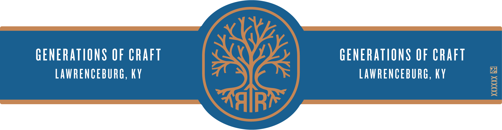

# TTB COLA Label Images - TTBID 25008001000469

**Brand Name:** RUSSELL'S RESERVE

**Fanciful Name:** 13 YEARS OLD

**Issue Date:** 01/10/2025

**Origin Code:** 22

**Product Class/Type:** 101

**Source:** [TTB Public COLA Registry](https://ttbonline.gov/colasonline/viewColaDetails.do?action=publicFormDisplay&ttbid=25008001000469)

## Label Images

### Front Label

### Label 2

### Label 3

## Extracted Label Text

*Text extracted via OCR - may contain errors*

### Front Label

THIS DISTINCTIVE BOURBON, AGED 13 YEARS AND BOTTLED AT BARREL PROOF, SHOWCASES THE

RUSSELLS’ DECADES OF WHISKEY-MAKING EXPERIENCE AND EXPERT ABILITY TO DEVELOP COMPLEX

FLAVOR THROUGH CAREFUL AGING AND KEEN BARREL SELECTION. EACH BOTTLE REPRESENTS THE

PERFECT EXPRESSION OF THE BARREL, MASTERFULLY CRAFTED TO BE OPENED, POURED AND SHARED

RUSSELLS

RESERVE

KENTUCKY STRAIGHT BOURBON WHISKEY

000000 Ez:

### Label 2

THOUGHTFULLY SELECTED AND

DISTILLING COMPANY, LAWRENCEBURG, KENTUCKY

DISTILLED & BOTTLED BY THE WILD TURKEY

_———— ae)

INTENTIONALLY CRAFTED, THIS

_———— ae)

——————| =)

BOURBON IS A TESTAMENT TO

BARREL PROOF

GOVERNMENT WARNING: (I) ACCORDING T0 THE

_ ee)

THE REVERED MASTERY OF

NON-CHILL FILTERED

SURGEON GENERAL, WOMEN SHOULD NOT DRINK ALCOHOLIC

_ =)

BEVERAGES DURING PREGNANCY BECAUSE OF THE RISK

EDDIE RUSSELL, BOTTLED IN

OF BIRTH DEFECTS. (2) CONSUMPTION OF ALCOHOLIC

BEVERAGES IMPAIRS YOUR ABILITY TO DRIVE ACAR OR s

MASTER DISTILLERS

YEARS OLD

OPERATE MACHINERY, AND MAY CAUSE HEALTH PROBLEMS, =

### Label 3

Ol

GENERATIONS OF CRAFT

GENERATIONS OF CRAFT

LAWRENCEBURG, KY

LAWRENCEBURG, KY
