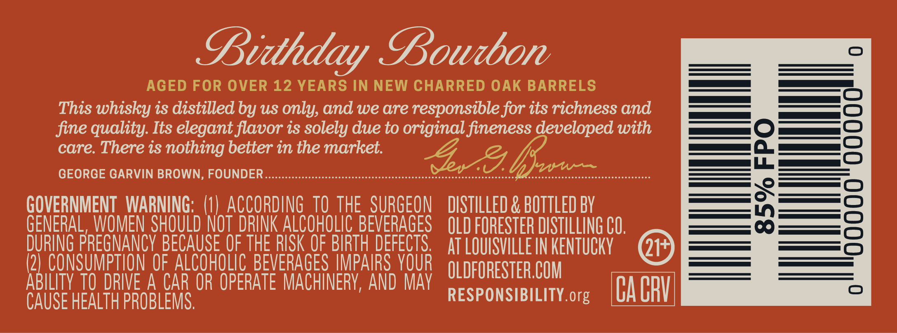
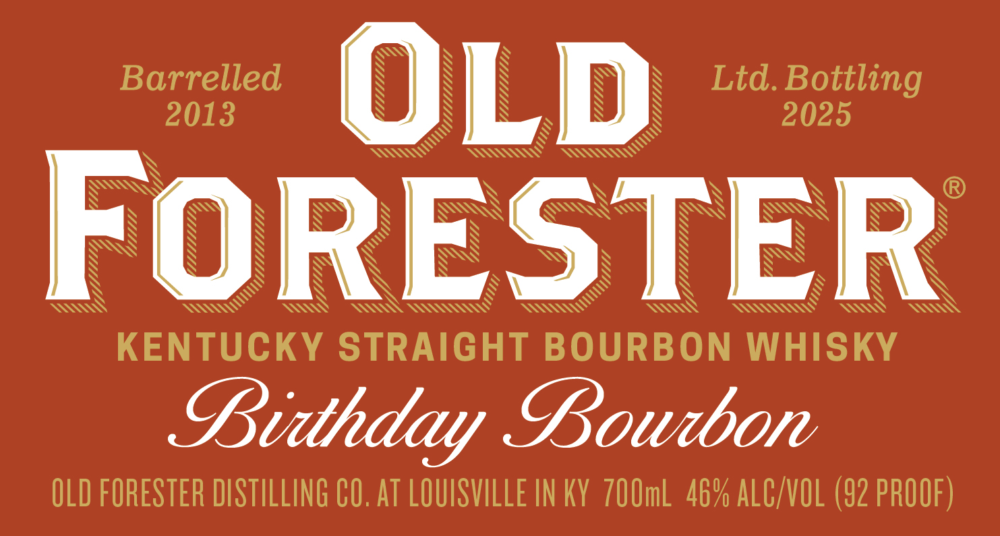
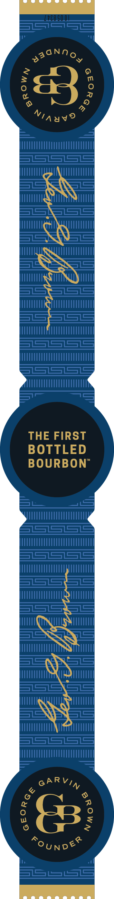
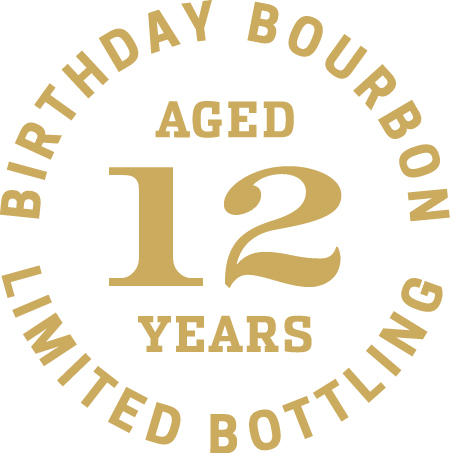

# TTB COLA Label Images - TTBID 25013001000088

**Brand Name:** OLD FORESTER

**Fanciful Name:** BIRTHDAY BOURBON 2025

**Issue Date:** 01/14/2025

**Origin Code:** 22

**Product Class/Type:** 101

**Source:** [TTB Public COLA Registry](https://ttbonline.gov/colasonline/viewColaDetails.do?action=publicFormDisplay&ttbid=25013001000088)

## Label Images

### Back Label

### Front Label

### Label 3

### Label 4

### Label 5

## Extracted Label Text

*Text extracted via OCR - may contain errors*

*3 image(s) excluded: text did not meet readability threshold*

### Back Label

Lidhday Lourbon

AGED FOR OVER 12 YEARS IN NEW CHARRED OAK BARRELS
This whisky is distilled by us only, and we are responsible for its richness and
fine quality. Its elegant flavor is solely due to original fineness developed with
care. There is nothing better in the market.

GEORGE GARVIN BROWN: FOUNDER er rrrerreeeeccscceeeccccetetsecesnsress eerie ted “Ae PA taniogemnre

GOVERNMENT WARNING: (1) ACCORDING T0 THE SURGEON DISTILLED & BOTTLED BY
GENERAL, WOMEN SHOULD NOT DRINK ALCOHOLIC BEVERAGES OLD FORESTER DISTILLING CO.
DURING PREGNANCY BECAUSE OF THE RISK OF BIRTH DEFECTS. AT LOUISVILLEIN KENTUCKY

(2) CONSUMPTION OF ALCOHOLIC BEVERAGES IMPAIRS YOUR qi nrqnesTrA COM

perkates OPERATE MACHINERY, AND MAY RESPONSIBILITY.org CAGRY

### Front Label

4,
y

Ltd. Bottling

Barrelled
2025

2013

LLL Lhd,
CLL
LLL dda

Z
ULLIIILLLS

UY

§ s
Ay SS

SSS

S
N
N
S
N
S

“Gy
yy
ULSI LST

S
S
SS

WY
S
SSA~“"“q SSAVy

At WActiarra WT As

SS
Wns Ws

KENTUCKY STRAIGHT BOURBON WHISKY

Luidhday Bourbon

OLD FORESTER DISTILLING CO. AT LOUISVILLE IN KY 700mL 46% ALC/VOL (92 PROOF)
