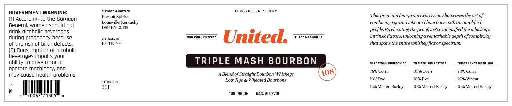
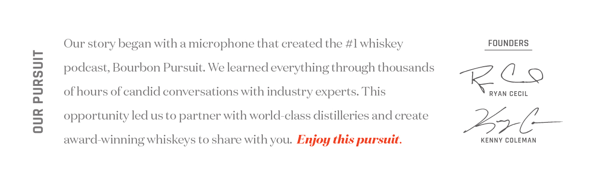

# TTB COLA Label Images - TTBID 25013001000125

**Brand Name:** PURSUIT UNITED

**Fanciful Name:** 108

**Issue Date:** 01/21/2025

**Origin Code:** 22

**Product Class/Type:** 121

**Source:** [TTB Public COLA Registry](https://ttbonline.gov/colasonline/viewColaDetails.do?action=publicFormDisplay&ttbid=25013001000125)

## Label Images

### Label 1

### Label 2

## Extracted Label Text

*Text extracted via OCR - may contain errors*

### Label 1

GOVERNMENT WARNING:

sLewoeo & eorriea

LOUISVILLE, KENTUCKY

Pursuit Spirits

This premium four grain expression showcases the art of

(1) According to the Surgeon

General, women should not

Louisville, Kentucky

combining rye and wheated bourbons with an amplified

DSP-KY-20135

profile. By elevating the proof, we've intensified the whiskey's

drink alcoholic beverages

during pregnancy because

isTiLeD IN

rie

‘Naw oH

Mast

intrinsic flavors, unlocking a remarkable depth of complexity

of the risk of birth defects.

KY-TNNY

= United

thatt spans the entire whiskey flavor spectrum.

(2) Consumption of alcoholic

beverages impairs your

ability to drive a car or

TRIPLE MASH BOURBON

‘exnasrawn BouReaN co.

“TUDISTLNG PARTNER

FINGER LAKES OISTILLNG

operate machinery, and

78% Corn

80% Corn

70% Com

May cause health problems,

A Blend of Straight Bourbon Whiskeys

xveH cone

Low Rye & Wheated Bourbons

10% Rye

10% Rye

10% Wheat

SCF

12% Malted Barley

10% Malted Barley

10% Malted Barley

|

ll

500

71305

Ih

!

°

108 PROOF

‘54% ALC/VOL

### Label 2

Our story began with a microphone that created the #1 whiskey

FOUNDERS

podeast, Bourbon Pursuit. We learned everything through thousands

KS CECIL

of hours of candid conversations with industry experts. This

opportunity led us to partner with world-class distilleries and create

AC —

KENNY COLEMAN

award-winning whiskeys to share with you. Enjoy this pursuit.
