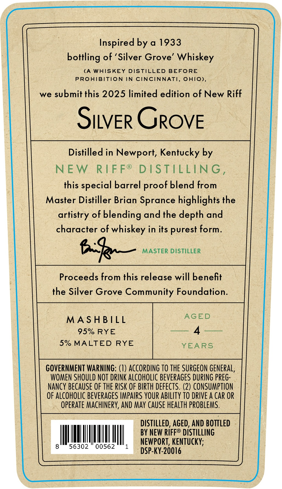
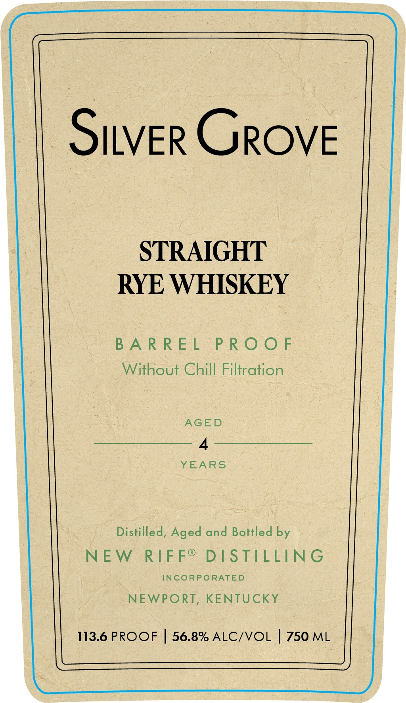
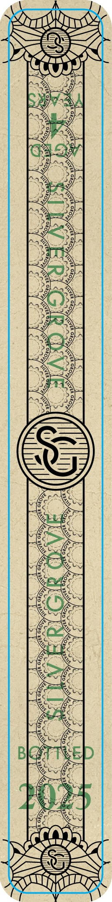

# TTB COLA Label Images - TTBID 25015001000072

**Brand Name:** SILVER GROVE

**Issue Date:** 01/21/2025

**Origin Code:** 22

**Product Class/Type:** 102

**Source:** [TTB Public COLA Registry](https://ttbonline.gov/colasonline/viewColaDetails.do?action=publicFormDisplay&ttbid=25015001000072)

## Label Images

### Back Label

### Front Label

### Label 3

## Extracted Label Text

*Text extracted via OCR - may contain errors*

*1 image(s) excluded: text did not meet readability threshold*

**Detected Proof:** 113.6

### Back Label

Inspired by a 1933

bottling of ‘Silver Grove’ Whiskey

(A WHISKEY DISTILLED BEFORE

PROHIBITION IN CINCINNATI, OHIO),

we submit this 2025 limited edition of New Riff

SitveR GROVE

Distilled in Newport, Kentucky by

NEW RIFF® DISTILLING,

this special barrel proof blend from

Master Distiller Brian Sprance highlights the

artistry of blending and the depth and

character of whiskey in its purest form.

teas eee

Proceeds from this release will benefit

the Silver Grove Community Foundation.

MASHBILL

AGED

95% RYE

ey A noase

5% MALTED RYE

YEAR

GOVERNMENT WARNING: (1) ACCORDING TO THE SURGEON GENERAL,

WOMEN SHOULD NOT DRINK ALCOHOLIC BEVERAGES DURING PREG-

NANCY BECAUSE OF THE RISK OF BIRTH DEFECTS. (2) CONSUMPTION

OF ALCOHOLIC BEVERAGES IMPAIRS YOUR ABILITY TO DRIVE A CAR OR

OPERATE MACHINERY, AND MAY CAUSE HEALTH PROBLEMS.

DISTILLED, AGED, AND BOTTLED

BY NEW RIFF® DISTILLING

NEWPORT, KENTUCKY;

Con

DSP-KY-20016

### Front Label

~Siver Grove

STRAIGHT

RYE WHISKEY

BARREL PROOF

Without Chill Filtration

AGED

YEARS

Distilled, Aged and Bottled by

NEW RIFF® DISTILLING

INCORPORATED

NEWPORT, KENTUCKY

113.6 PROOF | 56.8% ALC/VOL | 750 ML
