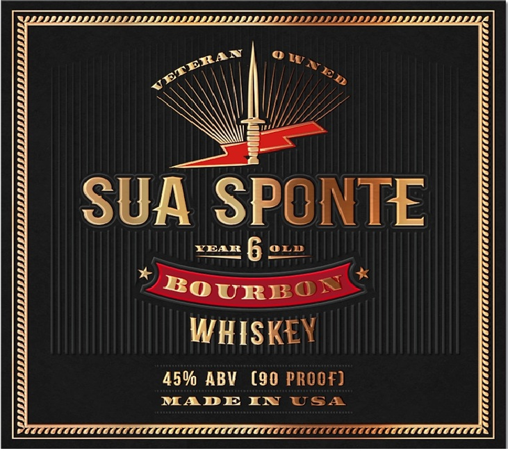
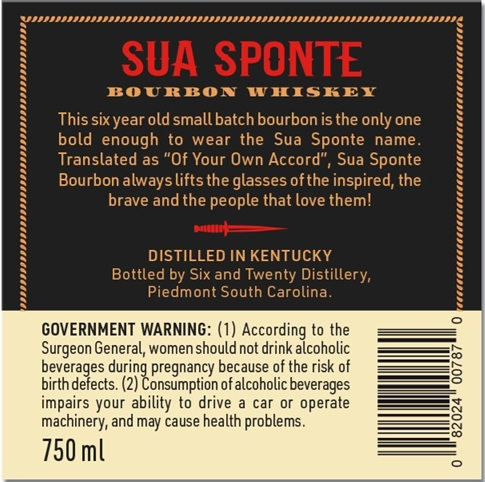

# TTB COLA Label Images - TTBID 25022001000133

**Brand Name:** SUA SPONTE

**Issue Date:** 01/27/2025

**Origin Code:** 41

**Product Class/Type:** 141

**Source:** [TTB Public COLA Registry](https://ttbonline.gov/colasonline/viewColaDetails.do?action=publicFormDisplay&ttbid=25022001000133)

## Label Images

### Front Label

### Label 2

## Extracted Label Text

*Text extracted via OCR - may contain errors*

**Detected Proof:** 90

### Front Label

SUA SPONTE
YEAL
6
OLD
BOURRON
WHISKEY
459 ABV
(90 PROOF)
MADE IN
USA

### Label 2

BOURBON WHISKEY

This six year old small batch bourbonis the only one
bold enough to wear the Sua Sponte name
Translated as "Of Your Own Accord", Sua Sponte
Bourbon always lifts the glasses of the inspired, the

brave and the people that love them!

DISTILLED IN KENTUCKY
Bottled by Six and Twenty Distillery,
Piedmont South Carolina

GOVERNMENT WARNING: (1) According to the
Surgeon General, women should not drink alcoholic
beverages during pregnancy because of the sk of
birthdefects. (2) Consumption of alcoholic beverages
impairs your ability to drive a car or operate
machinery, and may cause health problems.

750ml
