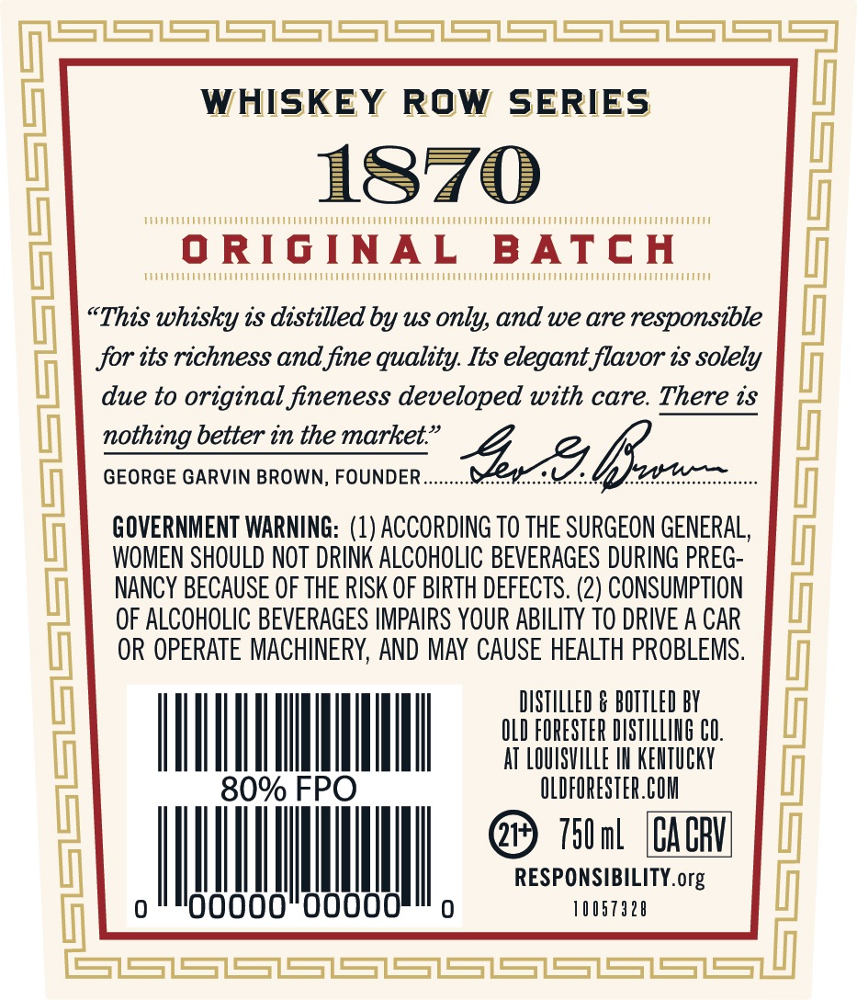
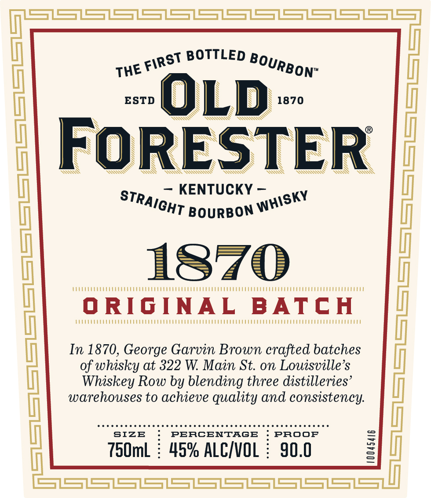
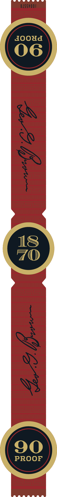

# TTB COLA Label Images - TTBID 25022001000723

**Brand Name:** OLD FORESTER

**Fanciful Name:** 1870 ORIGINAL BATCH

**Issue Date:** 01/23/2025

**Origin Code:** 22

**Product Class/Type:** 101

**Source:** [TTB Public COLA Registry](https://ttbonline.gov/colasonline/viewColaDetails.do?action=publicFormDisplay&ttbid=25022001000723)

## Label Images

### Back Label

### Front Label

### Label 3

## Extracted Label Text

*Text extracted via OCR - may contain errors*

*1 image(s) excluded: text did not meet readability threshold*

### Back Label

WHISKEY ROW SERIES

1870

“ORIGINAL ‘BATCH

“This whisky ts distilled by us only, and we are responsible

jor tts richness and fine quality. Its elegant flavor ts solely

due to original fineness developed with care. There ts

nothing better in the market.”

GEORGE GARVIN BROWN, FOUNDER

GOVERNMENT WARNING: (1) ACCORDING T0 THE SURGEON GENERAL,

WOMEN SHOULD NOT DRINK ALCOHOLIC BEVERAGES DURING PREG

NANCY BECAUSE OF THE RISK OF BIRTH DEFECTS. (2) CONSUMPTION

OF ALCOHOLIC BEVERAGES IMPAIRS YOUR ABILITY TO DRIVE A CAR

OR OPERATE MACHINERY, AND MAY CAUSE HEALTH PROBLEMS.

DISTILLED & BOTTLED BY

OLD FORESTER DISTILLING CO.

I.

AT re : KENTUCKY

@ Tital (Caen

AA,

RESPONSIBILITY. org

### Front Label

gt BOTTLED agy,

W FIR

ON”

ESTD

1870

SSX

SSN

SX

SN

Ss

“

\S

N

— KENTUCKY -

KY

ST, Ion

T BourBON

1870

TE

‘ORIGINAL BATCH

Ue

CU

In 1870, George Garvin Brown crafted batches

of whisky at 322 W. Main St. on Louisville’s

Whiskey Row by blending three distilleries

warehouses to achieve quality and consistency.

Dene eee r en cscecececescccecececesenesesceseseseeeees

SIZE

PERCENTAGE

PROOF

750mL : 45% ALC/VOL : 90.0
