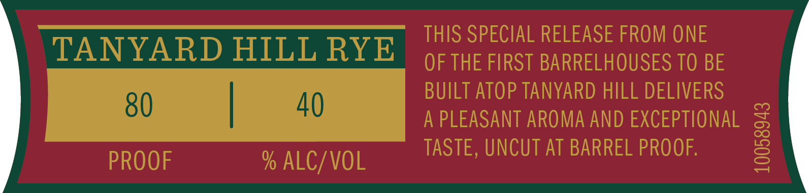
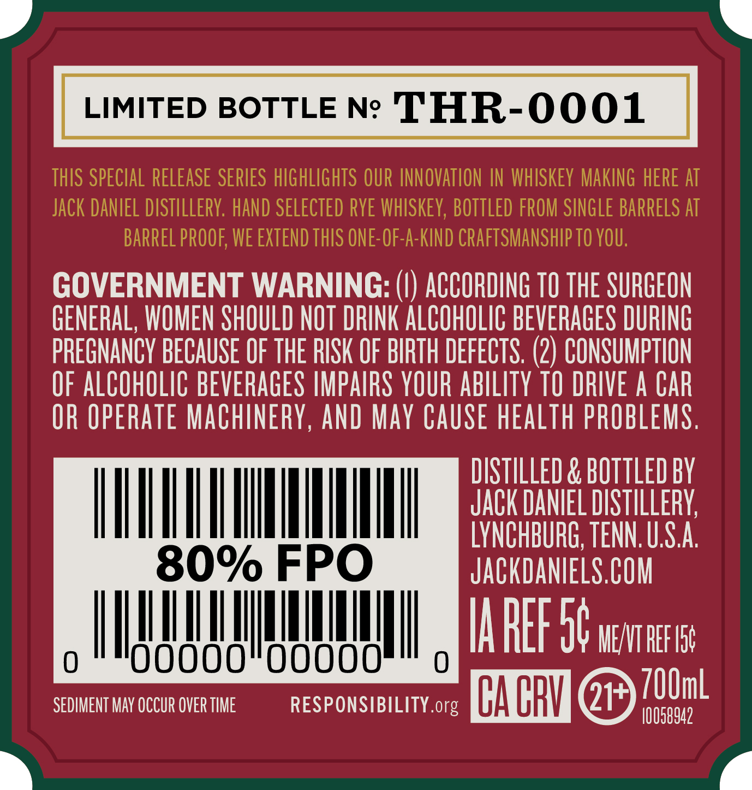
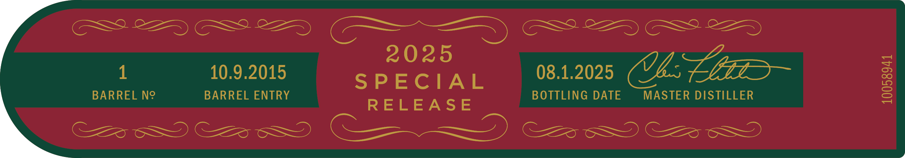

# TTB COLA Label Images - TTBID 25028001000211

**Brand Name:** JACK DANIEL'S

**Fanciful Name:** SINGLE BARREL SPECIAL RELEASE

**Issue Date:** 02/13/2025

**Origin Code:** 43

**Product Class/Type:** 140

**Source:** [TTB Public COLA Registry](https://ttbonline.gov/colasonline/viewColaDetails.do?action=publicFormDisplay&ttbid=25028001000211)

## Label Images

### Front Label

### Label 3

### Label 4

## Extracted Label Text

*Text extracted via OCR - may contain errors*

*1 image(s) excluded: text did not meet readability threshold*

### Label 3

LIMITED BOTTLE Nc THR-OOO1

GOVERNMENT WARNING: (|) ACCORDING 10 THE SURGEON
GENERAL, WOMEN SHOULD NOT DRINK ALCOHOLIC BEVERAGES DURING
PREGNANCY BECAUSE OF THE RISK OF BIRTH DEFECTS. (2) CONSUMPTION
QF ALCOHOLIC BEVERAGES IMPAIRS YOUR ABILITY T0 DRIVE A CAR
QR OPERATE MACHINERY, AND MAY CAUSE HEALTH PROBLEMS.

DISTILLED & BOTTLED BY
EL ecient
80% FPO JACKDANIELS.COM

STII UAE stn
SEDIMENT MAY OCCUR OVER TIME RESPONSIBILITY.org A GRY QF [00m

### Label 4

2025 SG
1 10.9.2015 08.1.2025 bs gi
SPECIAL
BARREL N° BARREL ENTRY RELEASE BOTTLING DATE MASTER DISTILLER

10058941
