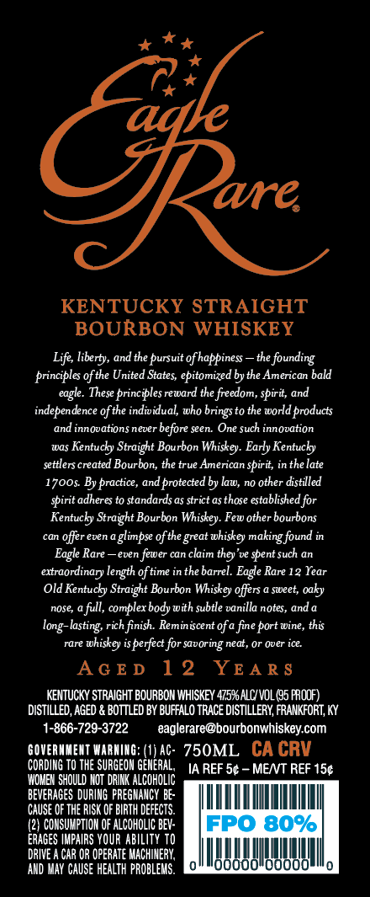
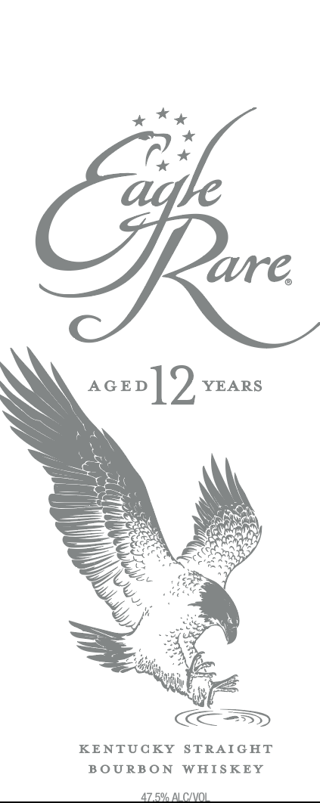

# TTB COLA Label Images - TTBID 25030001000269

**Brand Name:** EAGLE RARE

**Issue Date:** 01/31/2025

**Origin Code:** 22

**Product Class/Type:** 101

**Source:** [TTB Public COLA Registry](https://ttbonline.gov/colasonline/viewColaDetails.do?action=publicFormDisplay&ttbid=25030001000269)

## Label Images

### Back Label

### Front Label

## Extracted Label Text

*Text extracted via OCR - may contain errors*

### Back Label

ah

*

*

ave.

KENTUCKY STRAIGHT

BOURBON WHISKEY

Life, liberty, and the pursuit of happiness — the founding

principles ofthe United States, epitomized by the American bald

eagle. These principles reward the freedom, spirit, and

independence of the individual, who brings to the world products

and innovations never before seen. One such innovation

was Kentucky Straight Bourbon

iskey. Early Kentucky

settlers created Bourbon, the true American spirit, in the late

1700s. By practice, and protected by law, no other distilled

spirit adheres to standards as strict as those established for

Kentucky Straight Bourbon Whiskey. Few other bourbons

can offer even a glimpse ofthe great whiskey making found in

Eagle Rare —even fewer can claim they've spent such an

extraordinary length of time in the barrel. Eagle Rare 12 Year

(Old Kentucky Straight Bourbon

iskey offers a sweet, oaky

nose, a full, complex body with subtle vanilla notes, anda

long-lasting, rich finish. Reminiscent of a fine port wine, this

rare whiskey is perfect for savoring neat, or over ice.

AGED 12 YEARS

KENTUCKY STRAIGHT BOURBON WHISKEY 475% ALC/ VOL (G5 PROOF)

DISTILLED, AGED & BOTTLED BY BUFFALO TRACE DISTILLERY, FRANKFORT, KY

1-866-729-3722

eaglerare@bourbonwhiskey.com

GOVERNMENT WARNING: (1) AC- 750ML CA GRY

CORDING TO THE SURGEON GENERAL,

IA REF 5¢ - MET REF 15¢

‘WOMEN SHOULD NOT DRINK ALC

BEVERAGES DURING PREGNANCY BE-

NOOO

‘CAUSE OF THE RISK OF BIRTH DEFECTS.

(2} CONSUMPTION OF ALCOHOLIC BEV-

ERAGES IMPAIRS YOUR ABILITY TO

DRIVE A CAR OR OPERATE MACHINERY,

‘AND MAY CAUSE HEALTH PROBLEMS.

IM,

### Front Label

a Kk

C*

ave,

aceon]? YEARS

SS

i)

a

z

KOSS

KENTUCKY STRAIGHT

BOURBON WHISKEY

47.5% ALC/VOL.
