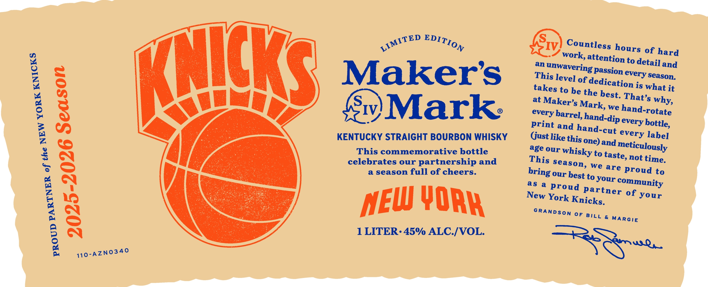
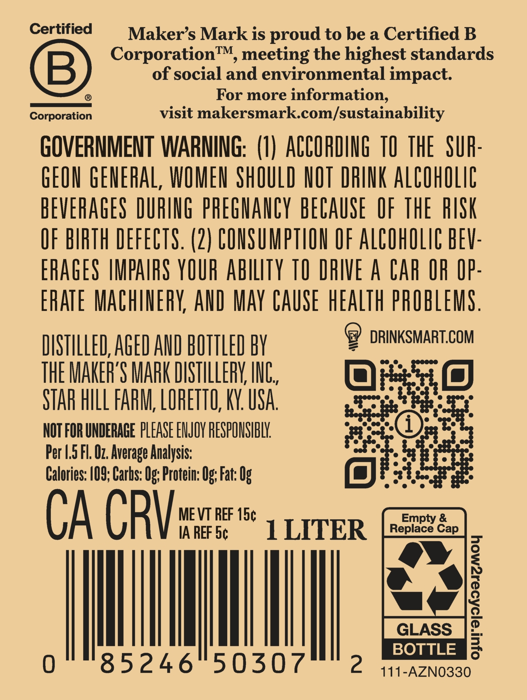

# TTB COLA Label Images - TTBID 25031001000252

**Brand Name:** MAKER'S MARK

**Issue Date:** 02/03/2025

**Origin Code:** 22

**Product Class/Type:** 101

**Source:** [TTB Public COLA Registry](https://ttbonline.gov/colasonline/viewColaDetails.do?action=publicFormDisplay&ttbid=25031001000252)

## Label Images

### Label 1

### Label 2

## Extracted Label Text

*Text extracted via OCR - may contain errors*

**Detected Proof:** 90

### Label 1

wit

ED EDIT,

Countless hour

S of hard

work,

Tin:

» attention to detail and

This leve]

an unwave

ing Passion every season,

IC

Maker's

of dedication is

takes tob

e the

what it

Ss

best. T

hat’s why,

i he

at Maker SMa

rk,

1v)

7

Mark:

every barrel, hand

we hand-rotate

-dip every bott] le,

Print and hand-

cut every label]

KENTUCKY STRAIGHT BOURBON WHISKY

Gust like this one)

This commemorative bottle

and meticulously

age our whisky t

0 taste not time

celebrates our partnership and

This Season, w,

a season full of cheers.

bring our best to

© are proud to

your community

S 4 proud pa

New York Knic

ks.

rtner of youn

AEW YORY

GRANDson OF BILL & MARGIE

1 LITER: 45% ALC./VOL.

110-AZNO340

TRS

### Label 2

Certified

Maker’s Mark is proud to be a Certified B

Corporation™, meeting the highest standards

of social and environmental impact

&

®

For more information.

Corporati

visit makersmark.com/sustainability

GOVERNMENT WARNING: (1) ACCORDING 10 THE SUR

GEON GENERAL, WOMEN SHOULD NOT DRINK ALCOHOLIC

BEVERAGES DURING PREGNANCY BECAUSE OF THE RISK

OF BIRTH DEFECTS. (2) CONSUMPTION OF ALCOHOLIC BEV

ERAGES IMPAIRS YOUR ABILITY TO DRIVE A CAR OR OP

ERATE MACHINERY, AND MAY CAUSE HEALTH PROBLEMS

9 DRINKSMART.COM

DISTILLED, AGED AND BOTTLED BY

THE MAKER'S MARK DISTILLERY, INC

STAR HILL FARM, LORETO, KY. USA

a

NOT FOR UNDERAGE PLEASE ENJOY RESPONSIBLY

Per 1.5 Fl. Oz. Average Analysis

Calories: 109; Carhs: Og: Protein: Og: Fat: Og

a

CA CRY

MEVT REF 15¢

IA REF 5¢

1 LITER

|

|

|

|

85246 50307

BOTTLE

2 111-AZN0330
