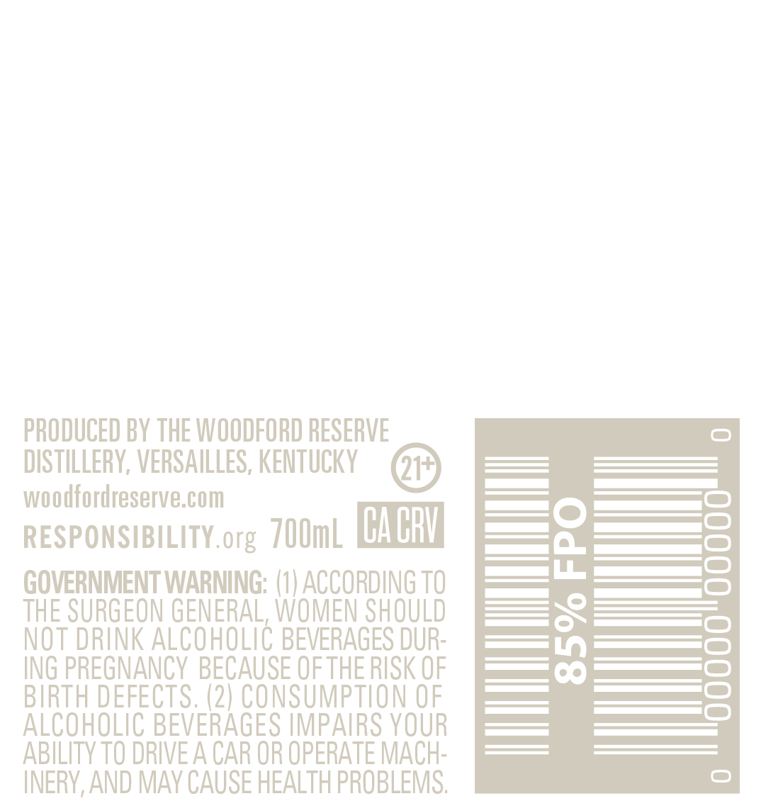

# TTB COLA Label Images - TTBID 25042001000109

**Brand Name:** WOODFORD RESERVE

**Fanciful Name:** MASTER'S COLLECTION SWEET OAK

**Issue Date:** 03/03/2025

**Origin Code:** 22

**Product Class/Type:** 101

**Source:** [TTB Public COLA Registry](https://ttbonline.gov/colasonline/viewColaDetails.do?action=publicFormDisplay&ttbid=25042001000109)

## Label Images

### Back Label

### Front Label

### Label 4

## Extracted Label Text

*Text extracted via OCR - may contain errors*

*2 image(s) excluded: text did not meet readability threshold*

### Back Label

PRODUCED BY THE WOODFORD RESERVE

DISTILLERY, VERSAILLES, KENTUCKY

woodfordreserve.com

_———— a)

———(=)

RESPONSIBILITY.org 700mL CACRY

2)

THE SURGEON GENERAL, WOMEN SHOULD

GOVERNMENT WARNING: (1) ACCORDING TO

NOT DRINK ALCOHOLIC BEVERAGES DUR

cs

ING PREGNANCY BECAUSE OF THE RISK OF

— | ———C_)

BIRTH DEFECTS. (2) CONSUMPTION OF

Lees =)

ALCOHOLIC BEVERAGES IMPAIRS YOUR

— SS)

ABILITY TO DRIVE A CAR OR OPERATE MACH-

INERY, AND MAY CAUSE HEALTH PROBLEMS
