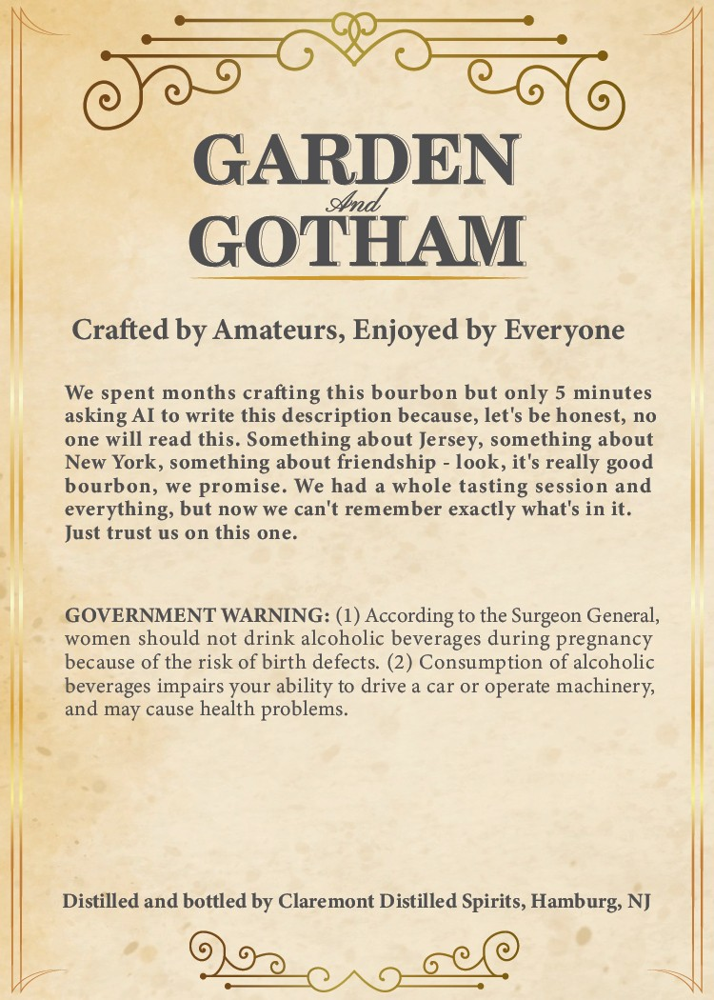
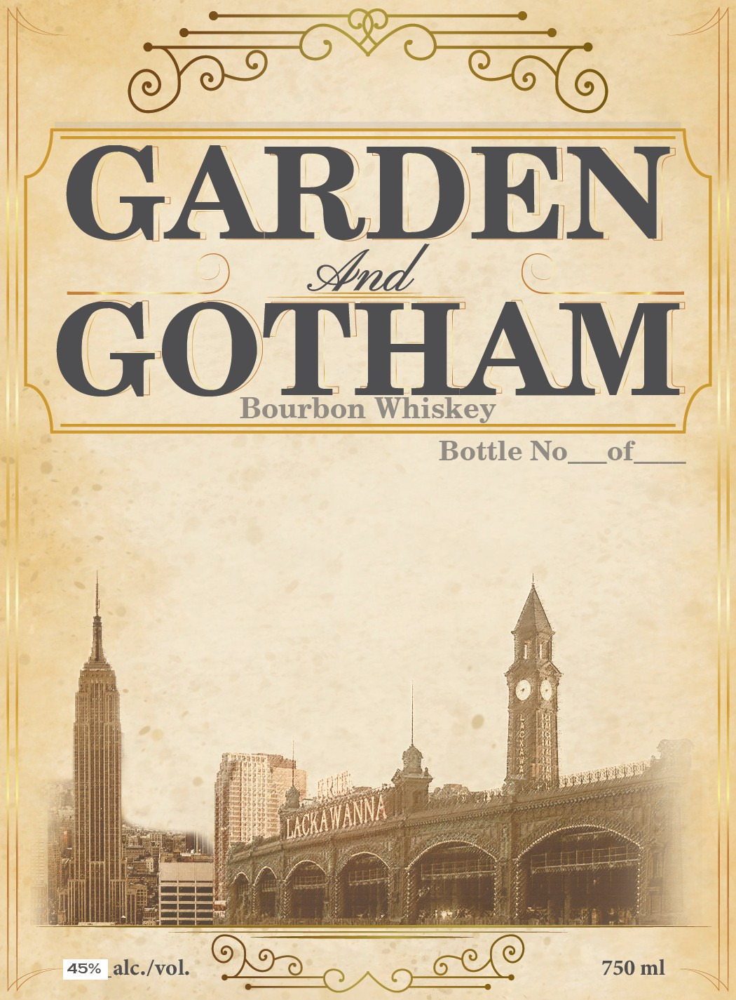

# TTB COLA Label Images - TTBID 25042001000276

**Brand Name:** GARDEN AND GOTHAM

**Issue Date:** 02/12/2025

**Origin Code:** 03

**Product Class/Type:** 101

**Source:** [TTB Public COLA Registry](https://ttbonline.gov/colasonline/viewColaDetails.do?action=publicFormDisplay&ttbid=25042001000276)

## Label Images

### Back Label

### Front Label

## Extracted Label Text

*Text extracted via OCR - may contain errors*

### Back Label

F

soma

GARDEN

GOTHAM

Crafted by Amateurs, Enjoyed by Everyone

|

We spent months crafting this bourbon but only 5 minutes

asking AI to write this description because, let's be honest, no

one will read this. Something about Jersey, something about

New York, something about friendship - look, it's really good

bourbon, we promise. We had a whole tasting session and

everything, but now we can't remember exactly what's in it.

Just trust us on this one,

’

|

|

GOVERNMENT WARNING: (1) According to the Surgeon General,

women should not drink alcoholic beverages during pregnancy

because of the risk of birth defects. (2) Consumption of alcoholic

beverages impairs your ability to drive a car or operate machinery,

r

and may cause health problems.

|

|

Distilled and bottled by Claremont Distilled Spirits, Hamburg, NJ

Oa. pee

### Front Label

G

N

2 hid

C=

|

|

GOTHAM

Bearnaie Whiskey

i

Bottle No__ of. | |

|

|

neces

4s% alc./vol. D9 bee

750 ml
