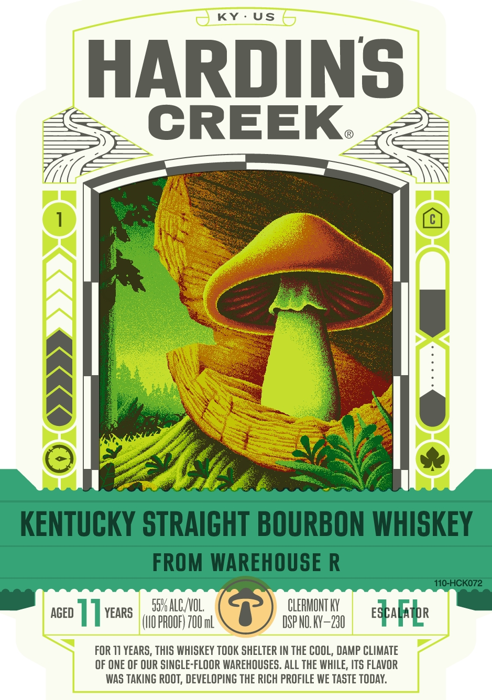
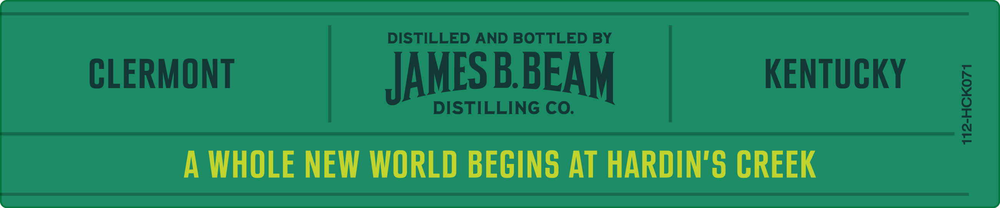
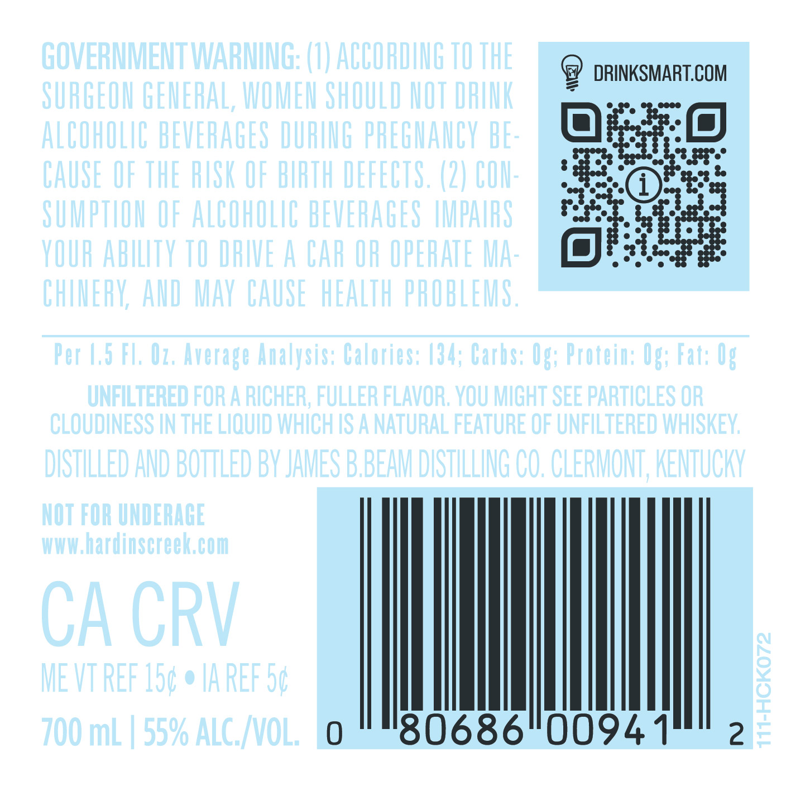

# TTB COLA Label Images - TTBID 25043001000042

**Brand Name:** HARDIN'S CREEK

**Issue Date:** 02/12/2025

**Origin Code:** 22

**Product Class/Type:** 101

**Source:** [TTB Public COLA Registry](https://ttbonline.gov/colasonline/viewColaDetails.do?action=publicFormDisplay&ttbid=25043001000042)

## Label Images

### Label 1

### Label 2

### Label 3

## Extracted Label Text

*Text extracted via OCR - may contain errors*

*1 image(s) excluded: text did not meet readability threshold*

**Detected Age:** 11 Years

### Label 1

ssualcvo. (>) CLeRMONTY
cep | | vars (IO ROOF) 100 mL DSP NO. KY 290 eSpafribe
= |

FOR 11 YEARS, THIS WHISKEY TOOK SHELTER IN THE COOL, DAMP CLIMATE
OF ONE OF OUR SINGLE-FLOOR WAREHOUSES. ALL THE WHILE, ITS FLAVOR
WAS TAKING ROOT, DEVELOPING THE RICH PROFILE WE TASTE TODAY.

### Label 2

DISTILLED AND BOTTLED BY

CLERMONT

KENTUCKY

-

ce}

KK

JAMES BBEAM

DISTILLING CO.

A WHOLE NEW WORLD BEGINS AT HARDIN'S CREEK
