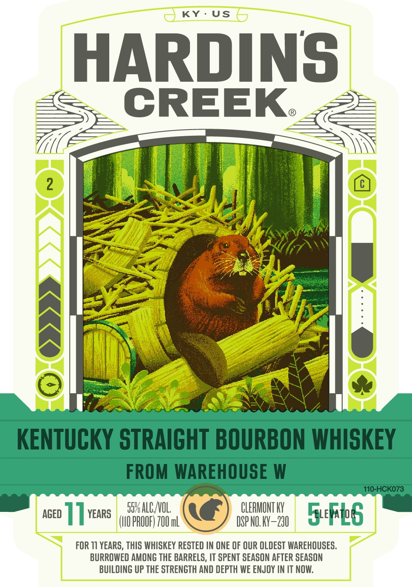
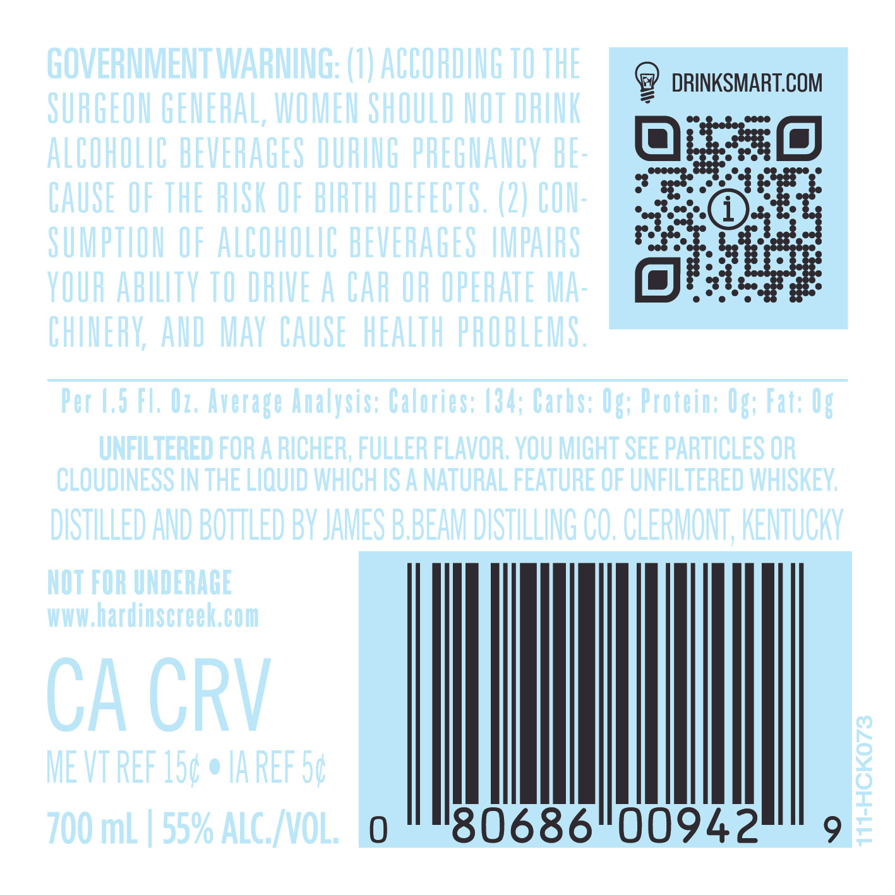

# TTB COLA Label Images - TTBID 25043001000047

**Brand Name:** HARDIN'S CREEK

**Issue Date:** 02/12/2025

**Origin Code:** 22

**Product Class/Type:** 101

**Source:** [TTB Public COLA Registry](https://ttbonline.gov/colasonline/viewColaDetails.do?action=publicFormDisplay&ttbid=25043001000047)

## Label Images

### Label 1

### Label 2

### Label 3

## Extracted Label Text

*Text extracted via OCR - may contain errors*

*1 image(s) excluded: text did not meet readability threshold*

**Detected Age:** 11 Years

### Label 1

ssuALCNOL (@, CLERMONT Y
cco] ] yews (uoPRooe) 00m NSS 7 spn xy—20 Fue b§
| |

FOR 11 YEARS, THIS WHISKEY RESTED IN ONE OF OUR OLDEST WAREHOUSES.
BURROWED AMONG THE BARRELS, IT SPENT SEASON AFTER SEASON
BUILDING UP THE STRENGTH AND DEPTH WE ENJOY IN IT NOW.

### Label 3

DISTILLED AND BOTTLED BY

CLERMONT

KENTUCKY

-

ce}

KK

JAMES BBEAM

DISTILLING CO.

A WHOLE NEW WORLD BEGINS AT HARDIN'S CREEK
