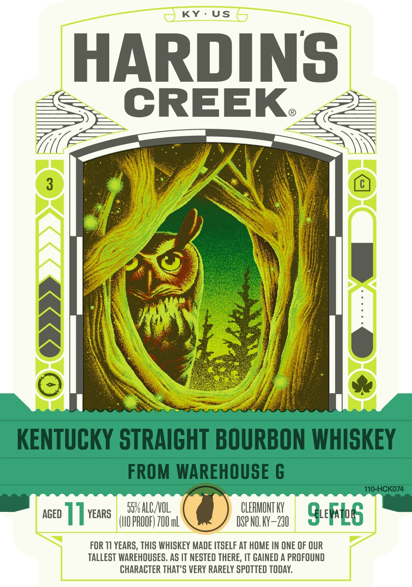
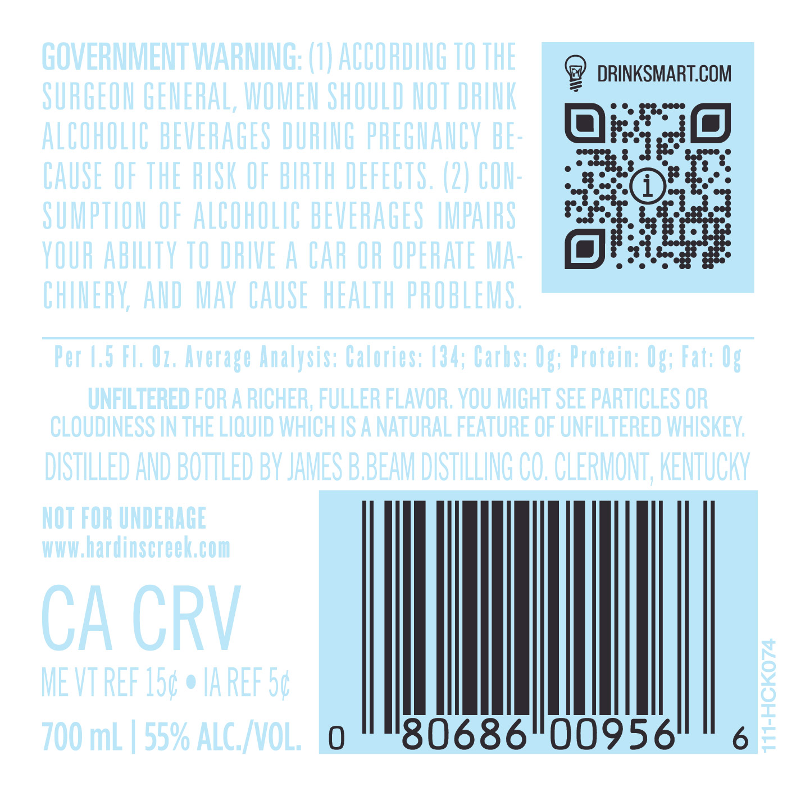

# TTB COLA Label Images - TTBID 25044001001024

**Brand Name:** HARDIN'S CREEK

**Issue Date:** 02/14/2025

**Origin Code:** 22

**Product Class/Type:** 101

**Source:** [TTB Public COLA Registry](https://ttbonline.gov/colasonline/viewColaDetails.do?action=publicFormDisplay&ttbid=25044001001024)

## Label Images

### Label 1

### Label 2

### Label 3

## Extracted Label Text

*Text extracted via OCR - may contain errors*

*1 image(s) excluded: text did not meet readability threshold*

**Detected Age:** 11 Years

### Label 1

KY:-US

HARDINS
a

‘OM >> >> 7

SALVO CLERMONT Y
aseo ] ] Ye ear win SFG

FOR 11 YEARS, THIS WHISKEY MADE ITSELF AT HOME IN ONE OF OUR
TALLEST WAREHOUSES. AS IT NESTED THERE, IT GAINED A PROFOUND
CHARACTER THAT'S VERY RARELY SPOTTED TODAY.

### Label 3

DISTILLED AND BOTTLED BY

CLERMONT

KENTUCKY

-

ce}

KK

JAMES BBEAM

DISTILLING CO.

A WHOLE NEW WORLD BEGINS AT HARDIN'S CREEK
