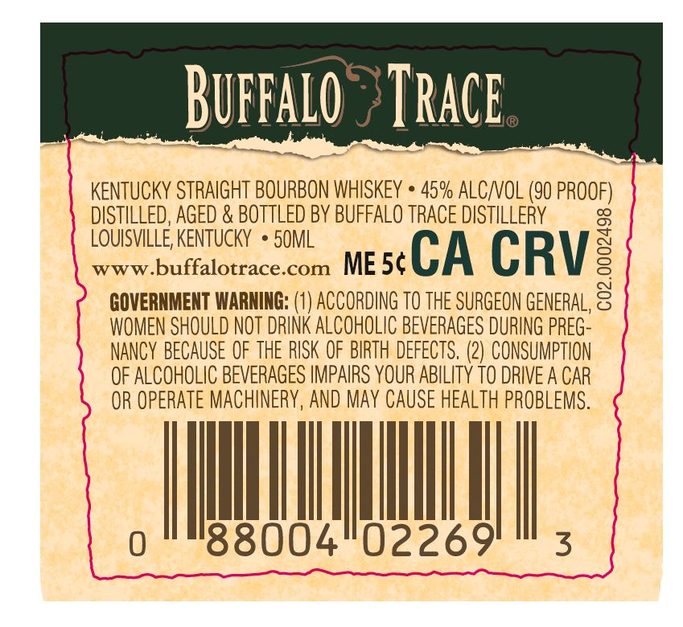

# TTB COLA Label Images - TTBID 25048001000235

**Brand Name:** BUFFALO TRACE

**Issue Date:** 02/18/2025

**Origin Code:** 22

**Product Class/Type:** 101

**Source:** [TTB Public COLA Registry](https://ttbonline.gov/colasonline/viewColaDetails.do?action=publicFormDisplay&ttbid=25048001000235)

## Label Images

### Back Label

## Extracted Label Text

*Text extracted via OCR - may contain errors*

### Back Label

pralo

eng

TRACE

eee oe

KENTUCKY STRAIGHT BOURBON WHISKEY * 45% ALC/VOL (90 PROOF)

ee}

DISTILLED, AGED & BOTTLED BY BUFFALO TRACE DISTILLERY

a

LOUISVILLE, KENTUCKY * 50ML

www.buffalotrace.com ME5¢

CA CRV:

GOVERNMENT WARNING: (1) ACCORDING TO THE SURGEON GENERAL, 2

WOMEN SHOULD NOT DRINK ALCOHOLIC BEVERAGES DURING PREG-

NANCY BECAUSE OF THE RISK OF BIRTH DEFECTS. (2) CONSUMPTION

OF ALCOHOLIC BEVERAGES IMPAIRS YOUR ABILITY TO DRIVE A CAR

OR OPERATE MACHINERY, AND MAY CAUSE HEALTH PROBLEMS.

MA

0

3

BB004U2269
