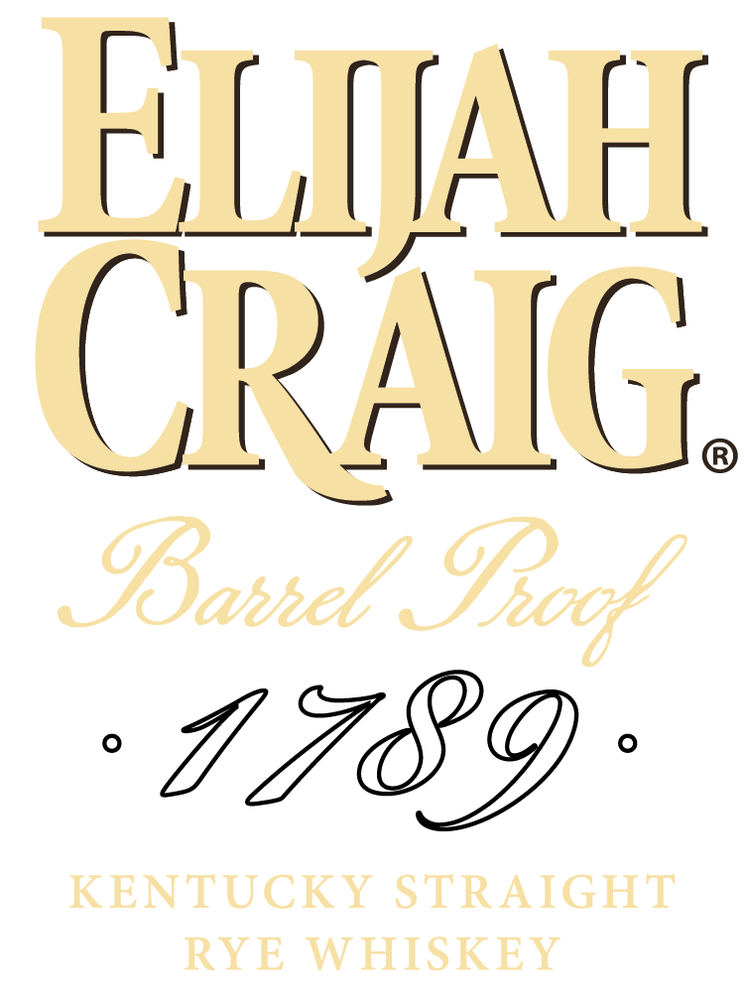
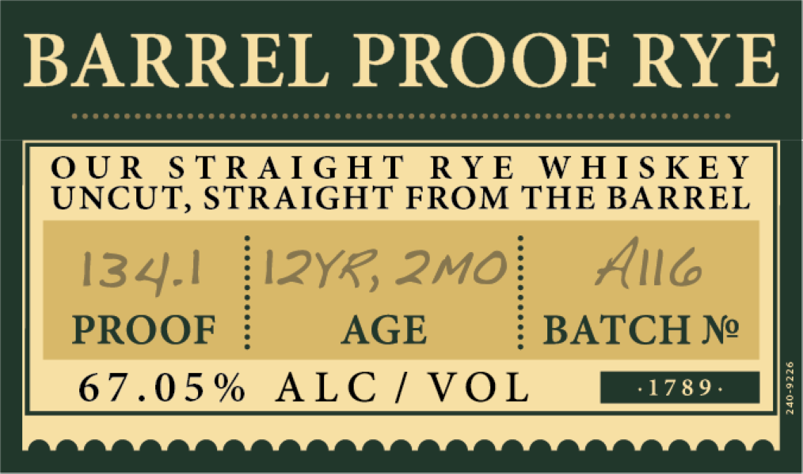
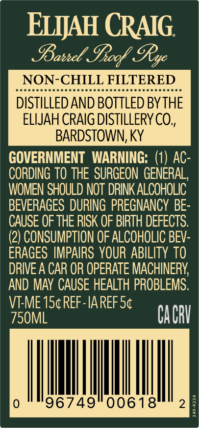

# TTB COLA Label Images - TTBID 25049001000197

**Brand Name:** ELIJAH CRAIG

**Fanciful Name:** BARREL PROOF RYE

**Issue Date:** 02/20/2025

**Origin Code:** 22

**Product Class/Type:** 102

**Source:** [TTB Public COLA Registry](https://ttbonline.gov/colasonline/viewColaDetails.do?action=publicFormDisplay&ttbid=25049001000197)

## Label Images

### Label 1

### Label 2

### Label 3

### Label 4

### Label 5

## Extracted Label Text

*Text extracted via OCR - may contain errors*

*3 image(s) excluded: text did not meet readability threshold*

**Detected Proof:** 134.1

### Label 2

BARREL PROOF RYE

PTETTETITITITTIT TTT TTT TTT

OUR

STRAIGHT RYE WHISKEY

UNCUT, STRAIGHT FROM THE BARREL

PROOF

AGE

BATCH Ne

67.05% ALC/ VOL

### Label 3

ELMJAH CRAIG.

Basse! Frof Ry

EPPPPPereerrererrrrrreserirrrsrrryiir trey

NON-CHILL FILTERED

DISTILLED AND BOTTLED BY THE

ELIJAH CRAIG DISTILLERY CO.,

BARDSTOWN, KY

GOVERNMENT WARNING: (1) AC

CORDING TO THE SURGEON GENERAL,

WOMEN SHOULD NOT DRINK ALCOHOLIC

BEVERAGES DURING PREGNANCY BE:

CAUSE OF THE RISK OF BIRTH DEFECTS.

(2) CONSUMPTION OF ALCOHOLIC BEV:

ERAGES IMPAIRS YOUR ABILITY TO

AND MAY CAUSE HEALTH PROBLEMS.

DRIVE A CAR OR OPERATE MACHINERY,

VI-ME 15¢ REF -IA REF 5¢

L

CACRY

|

|

|

|

|

0

96749

00618

2
