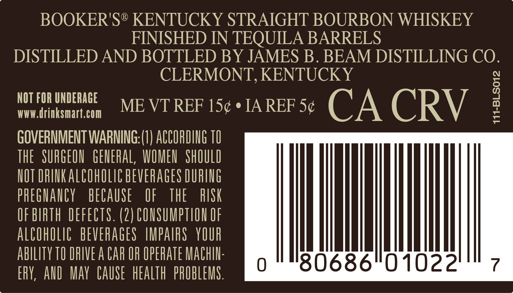

# TTB COLA Label Images - TTBID 25049001000438

**Brand Name:** BOOKER'S

**Fanciful Name:** THE RESERVE

**Issue Date:** 03/04/2025

**Origin Code:** 22

**Product Class/Type:** 641

**Source:** [TTB Public COLA Registry](https://ttbonline.gov/colasonline/viewColaDetails.do?action=publicFormDisplay&ttbid=25049001000438)

## Label Images

### Back Label

### Label 4

## Extracted Label Text

*Text extracted via OCR - may contain errors*

*1 image(s) excluded: text did not meet readability threshold*

### Back Label

BOOKER'S® KENTUCKY STRAIGHT BOURBON WHISKEY

FINISHED IN TEQUILA BARRELS

DISTILLED AND BOTTLED BY JAMES B. BEAM DISTILLING 20)

CLERMONT, KENTUCKY

NOT FOR UNDERAGE

WWW.drinksmart.com

ME VT REF 15¢ * IA REF 5¢ C A CRV

GOVERNMENT WARNING:(1) ACCORDING 10

THE SURGEON GENERAL, WOMEN SHOULD

NOT DRINK ALCOWOLIC BEVERAGES DURING

PREGNANCY BECAUSE

OF THE

RISK

OF BIRTH DEFECTS. (2) CONSUMPTION OF

ALCOHOLIC BEVERAGES IMPAIRS YOUR

ABILITY TO DRIVE A CAR OF OPERATE MACHIN

l

ERY, AND MAY CAUSE HEALTH PROBLEMS
