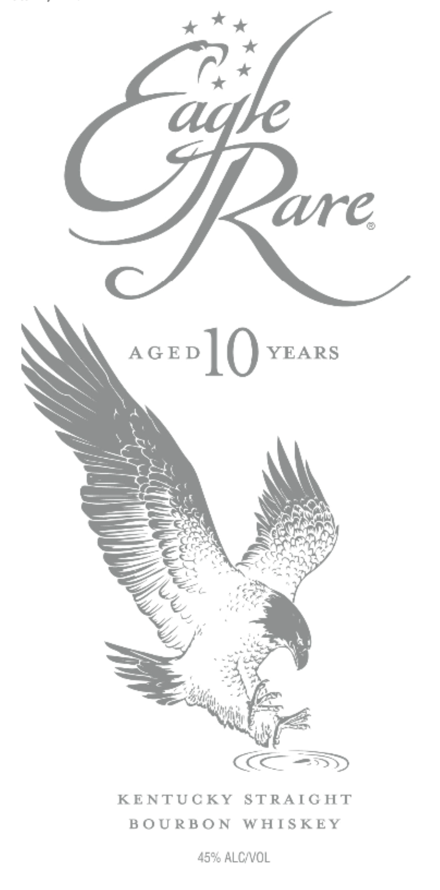
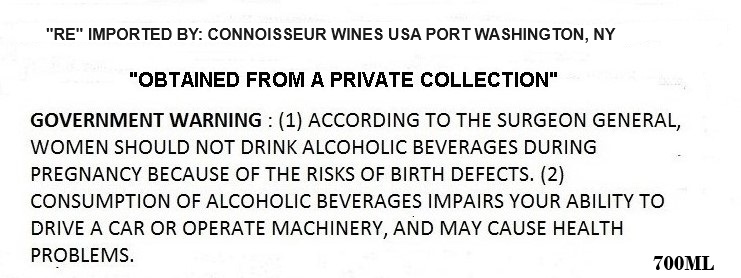

# TTB COLA Label Images - TTBID 25051001000882

**Brand Name:** EAGLE RARE

**Fanciful Name:** AGED 10 YEARS

**Issue Date:** 02/21/2025

**Origin Code:** 02

**Product Class/Type:** 101

**Source:** [TTB Public COLA Registry](https://ttbonline.gov/colasonline/viewColaDetails.do?action=publicFormDisplay&ttbid=25051001000882)

## Label Images

### Label 1

### Label 2

## Extracted Label Text

*Text extracted via OCR - may contain errors*

### Label 1

x Xt

(,.*

are.

acevo] () YEARS

SN

>

af

ne.

a,

=

&

ri,

AF

eit

Gi

Se

&

Ww

Zz

“e

uae

dl?

Ean

me)

cal

|

Sree.

wit

ay

ha i

cm SD

KENTUCKY STRAIGHT

BOURBON WHISKEY

45% ALC/VOL

### Label 2

“RE" IMPORTED BY: CONNOISSEUR WINES USA PORT WASHINGTON, NY

“OBTAINED FROM A PRIVATE COLLECTION"

GOVERNMENT WARNING : (1) ACCORDING TO THE SURGEON GENERAL,

WOMEN SHOULD NOT DRINK ALCOHOLIC BEVERAGES DURING

PREGNANCY BECAUSE OF THE RISKS OF BIRTH DEFECTS. (2)

CONSUMPTION OF ALCOHOLIC BEVERAGES IMPAIRS YOUR ABILITY TO

DRIVE A CAR OR OPERATE MACHINERY, AND MAY CAUSE HEALTH

PROBLEMS.

700ML
