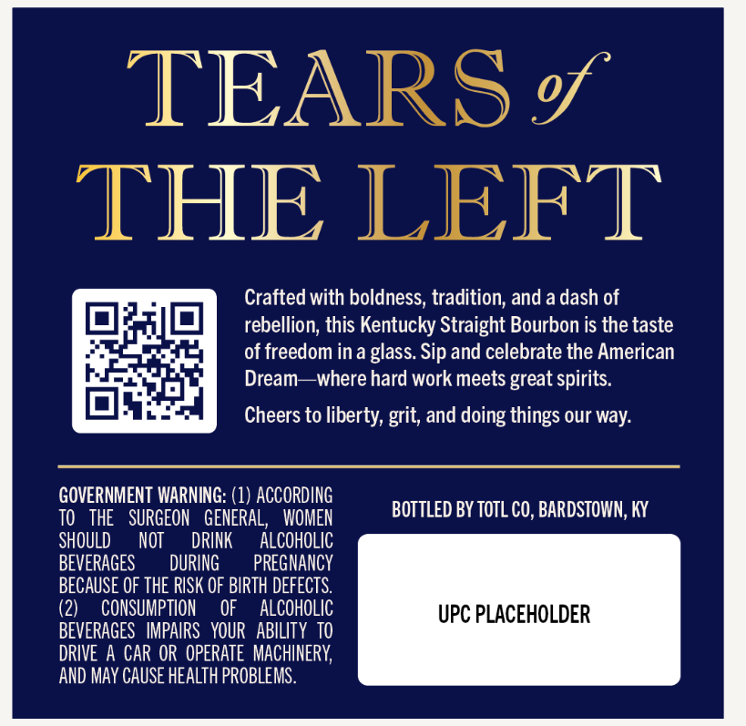
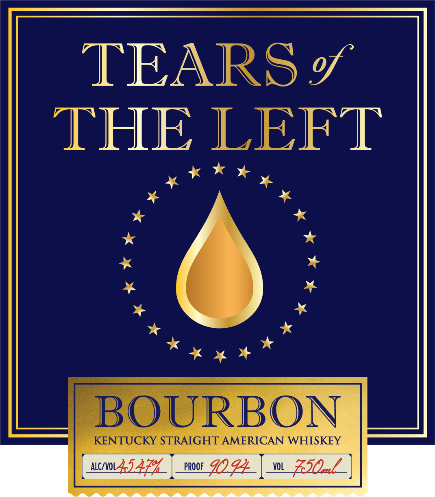

# TTB COLA Label Images - TTBID 25058001000052

**Brand Name:** TEARS OF THE LEFT

**Issue Date:** 02/28/2025

**Origin Code:** 22

**Product Class/Type:** 101

**Source:** [TTB Public COLA Registry](https://ttbonline.gov/colasonline/viewColaDetails.do?action=publicFormDisplay&ttbid=25058001000052)

## Label Images

### Back Label

### Label 1

### Label 2

## Extracted Label Text

*Text extracted via OCR - may contain errors*

*1 image(s) excluded: text did not meet readability threshold*

### Back Label

TEARS g
THE LEFT
Crafted with boldness; tradition; and a dash of
rebellion; this Kentucky Straight Bourbon is the taste
of freedom in a glass. Sip and celebrate the American
Dream
where hard work meets
spirits.
Cheers to liberty, grit; and doing things our way:
GOVERNMENT WARNING: (1) ACCORDING
TO
THE
SURGEON   GENERAL,
WOMEN
BOTTLED BY TOTL CO, BARDSTOWN; KY
ShOULD
NOT
DRINK
ALCOHOLIC
BEVERAGES
DURING
PREGNANCY
BECAUSE OF THE RISK OF BIPTH defecTS.
(2)
CONSUMPTION
OF
ALCOHOLIC
UPC PLACEHOLDER
BEVERAGES   IMPAIRS   YOUR   ABILITY TO
DRIVE A CAR OR OPERATE  MACHINERY,
AND MAY CAUSE HEalth PROBLEMS.
great

### Label 1

TEARS g
THE LEFT
BOURBON
KENTUCKY STRAIGHT AMERICAN WHISKEY
NcIV0LJ274
Prooe
902.4
VOL
ESOzl
