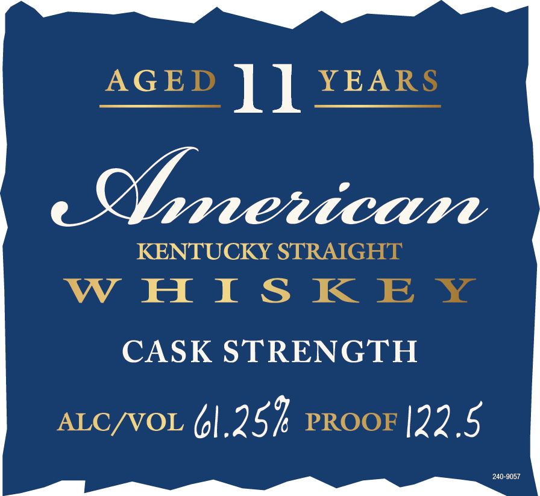

# TTB COLA Label Images - TTBID 25071001000251

**Brand Name:** PARKER'S HERITAGE COLLECTION

**Fanciful Name:** CASK STRENGTH

**Issue Date:** 03/20/2025

**Origin Code:** 22

**Product Class/Type:** 109

**Source:** [TTB Public COLA Registry](https://ttbonline.gov/colasonline/viewColaDetails.do?action=publicFormDisplay&ttbid=25071001000251)

## Label Images

### Back Label

### Label 1

## Extracted Label Text

*Text extracted via OCR - may contain errors*

### Back Label

Sa Ys

ZSSINGS

### Label 1

AGED ll YEARS

brrervicarn

KENTUCKY STRAIGHT

WHISKEY

CASK STRENGTH

ALC/VOL 61,25 PROOF [22,5

_ Ppe.n seco Tr lO ES
