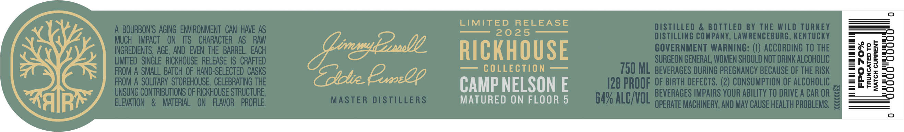

# TTB COLA Label Images - TTBID 25077001000050

**Brand Name:** RUSSELL'S RESERVE

**Fanciful Name:** SINGLE RICKHOUSE

**Issue Date:** 03/20/2025

**Origin Code:** 22

**Product Class/Type:** 101

**Source:** [TTB Public COLA Registry](https://ttbonline.gov/colasonline/viewColaDetails.do?action=publicFormDisplay&ttbid=25077001000050)

## Label Images

### Front Label

### Label 2

### Label 3

## Extracted Label Text

*Text extracted via OCR - may contain errors*

### Front Label

KENTUCKY STRAIGHT BOURBON WHISKEY

RUSSELLS

—— RESERVE |iGaieat

SINGLE RICKHOUSE

XXXXXX

### Label 2

mRO2 sO

=RES =O

=Ooc sO

Soo;

<0 =-

CAMP NELSON E

ELEg

=q55=0

=)

MATURED ON FLOOR 5

### Label 3

Pr

GENERATIONS OF CRAFT

GENERATIONS OF CRAFT

LAWRENCEBURG, KY

LAWRENCEBURG, KY

—
