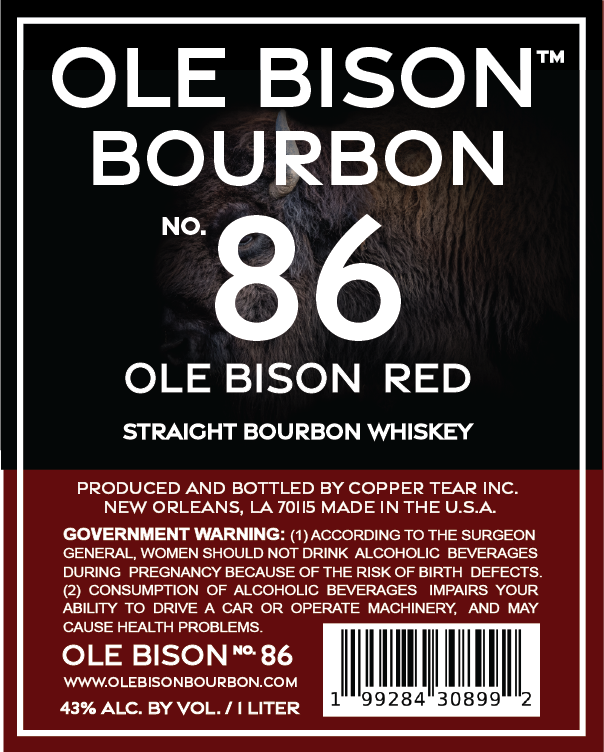

# TTB COLA Label Images - TTBID 25079001000626

**Brand Name:** OLE BISON NO.86 BOURBON

**Fanciful Name:** OLE BISON RED

**Issue Date:** 03/21/2025

**Origin Code:** 23

**Product Class/Type:** 101

**Source:** [TTB Public COLA Registry](https://ttbonline.gov/colasonline/viewColaDetails.do?action=publicFormDisplay&ttbid=25079001000626)

## Label Images

### Back Label

## Extracted Label Text

*Text extracted via OCR - may contain errors*

**Detected Proof:** 86

### Back Label

TM
OLE BISON
BOURBON
NO
86
OLE BISON
RED
STRAICHT BOURBON WHISKEY
PRODUCED AND BOTTLED BY COPPER TEAR INC
NEW ORLEANS
LA 701/5 MADE IN THE USA
GOVERNMENT WARNING: (1)ACCORDING TO THE SURGEON
GENERAL, WOMEN SHOULD NOT DRINK ALCOHOLIC BEVERAGES
DURING PREGNANCY BECAUSE OF THE RISK OF BIRTH DEFECTS
(2)
CONSUMPTION OF ALCOHOLIC BEVERAGES
IMPAIRS YOUR
ABILITY TO DRIVE A CAR OR OPERATE MACHINERY;
AND MAY
CAUSE HEALTH PROBLEMS
OLE BISON
NO.
86
WWWOLEBISONBOURBONCOM
43% ALC. BY VOL.
ILITER
99284"30899
