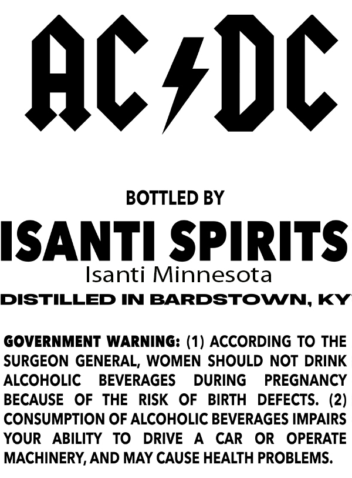
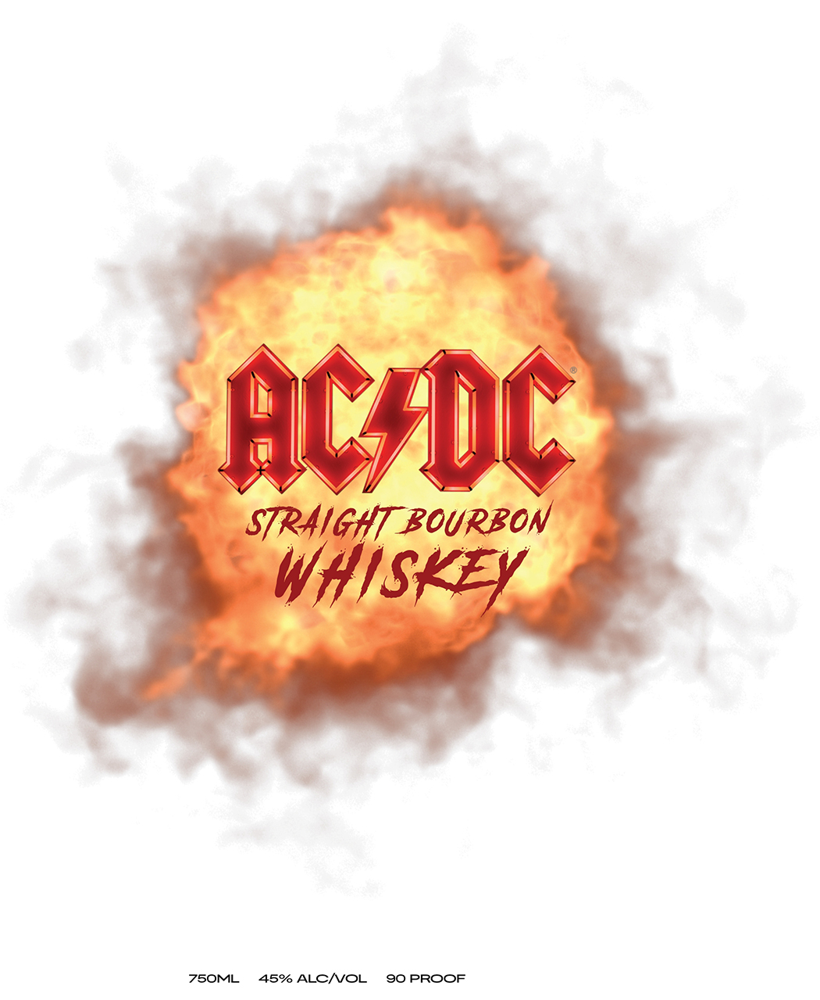

# TTB COLA Label Images - TTBID 25083001000933

**Brand Name:** AC/DC STRAIGHT BOURBON WHISKEY

**Issue Date:** 03/27/2025

**Origin Code:** 27

**Product Class/Type:** 101

**Source:** [TTB Public COLA Registry](https://ttbonline.gov/colasonline/viewColaDetails.do?action=publicFormDisplay&ttbid=25083001000933)

## Label Images

### Back Label

### Front Label

## Extracted Label Text

*Text extracted via OCR - may contain errors*

**Detected Proof:** 90

### Back Label

ACsDC

BOTTLED BY

ISANTI SPIRITS

Isanti Minnesota

DISTILLED IN BARDSTOWN, KY

GOVERNMENT WARNING: (1) ACCORDING TO THE

SURGEON GENERAL, WOMEN SHOULD NOT DRINK

ALCOHOLIC BEVERAGES DURING PREGNANCY

BECAUSE OF THE RISK OF BIRTH DEFECTS. (2)

CONSUMPTION OF ALCOHOLIC BEVERAGES IMPAIRS

YOUR ABILITY TO DRIVE A CAR OR OPERATE

MACHINERY, AND MAY CAUSE HEALTH PROBLEMS.

### Front Label

ACfDC
STRAIGHT BOURBON
whiskEY
Z5OML
45% ALCNOL
90 PROOF
