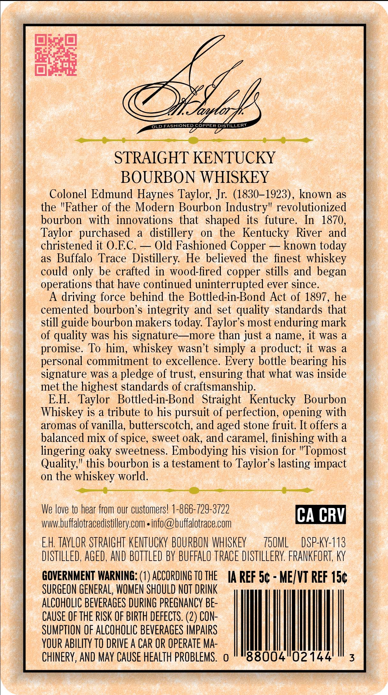
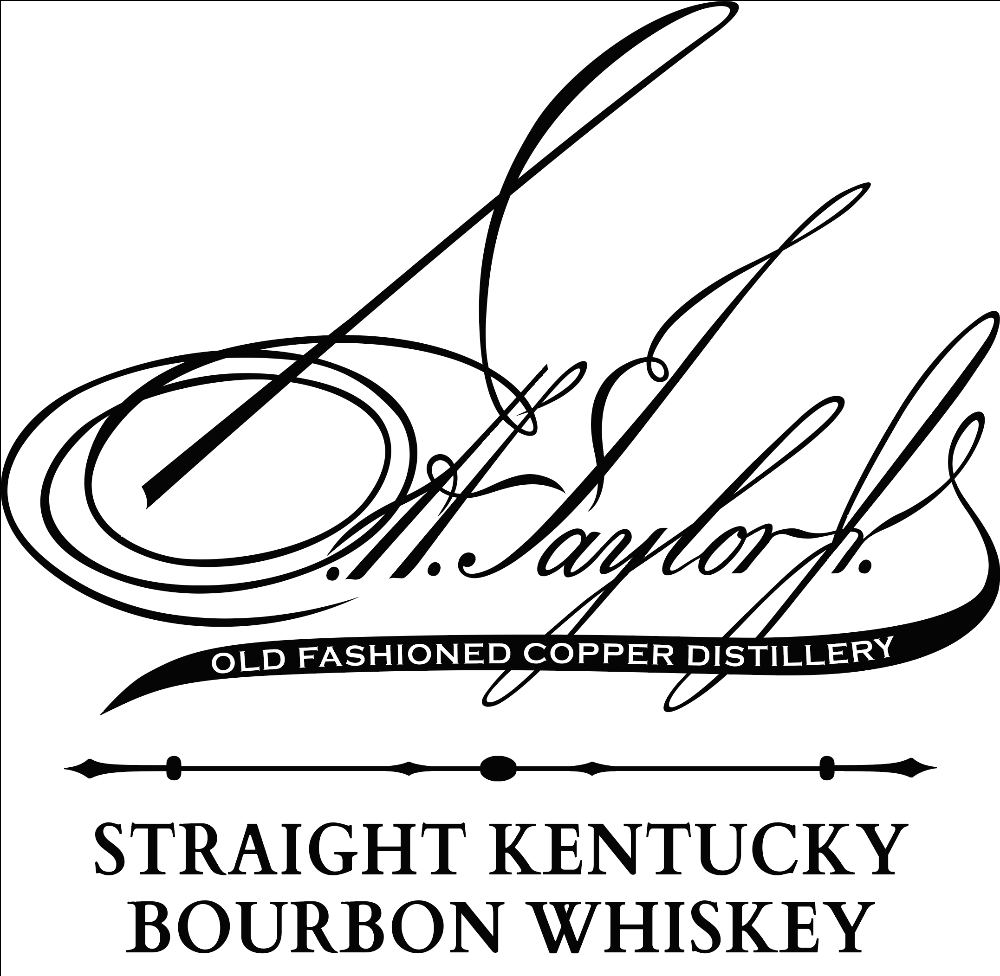
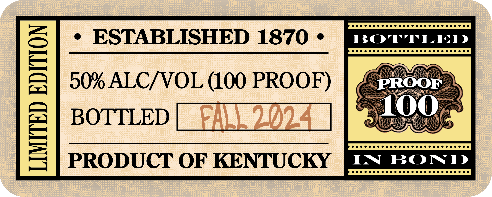

# TTB COLA Label Images - TTBID 25122001000085

**Brand Name:** EH TAYLOR

**Issue Date:** 05/02/2025

**Origin Code:** 22

**Product Class/Type:** 101

**Source:** [TTB Public COLA Registry](https://ttbonline.gov/colasonline/viewColaDetails.do?action=publicFormDisplay&ttbid=25122001000085)

## Label Images

### Back Label

### Label 1

### Label 2

## Extracted Label Text

*Text extracted via OCR - may contain errors*

*1 image(s) excluded: text did not meet readability threshold*

### Back Label

Bee LL

D FASHI

IONED COPPER mae

STRAIGHT KENTUCKY

BOURBON WHISKEY

Colonel Edmund Haynes Taylor, Jr. (1830-1923), known as

the Father of the Modern Bourbon Industry" revolutionized

bourbon with innovations that shaped its future. In 1870

Taylor purchased a distillery on the Kentucky River and

christened it O.EC. — Old Fashioned Copper — known today

as Buffalo Trace Distillery. He believed the finest whiskey

could only be crafted in wood-fired copper stills and began

operations that have continued uninterrupted ever since

A driving force behind the Bottled-in-Bond Act of 1897, he

cemented bourbon’s integrity and set quality standards that

still guide bourbon makers today. Taylor’s most enduring mark

of quality was his signature—more than just a name, it was a

promise. To him, whiskey wasn’t simply a product; it was a

personal commitment to excellence. Every bottle bearing his

signature was a pledge of trust, ensuring that what was inside

met the highest standards of craftsmanship

E.H. Taylor Bottled-in-Bond Straight Kentucky Bourbon

Whiskey is a tribute to his pursuit of perfection, opening with

aromas of vanilla, butterscotch, and aged stone fruit. It offers a

balanced mix of spice, sweet oak, and caramel, finishing with a

lingering oaky sweetness. Embodying his vision for 'Topmost

Quality," this bourbon is a testament to Taylor’s lasting impact

on the whiskey world

We love to hear from our customers! 1-866-729-3722

www.buffalotracedistillery.com « info@buffalotrace.com

CA CRV

EH, TAYLOR STRAIGHT KENTUCKY BOURBON WHISKEY

TSUML — DSP-KY-113

DISTILLED, AGED, AND BOTTLED BY BUFFALO TRACE DISTILLERY. FRANKFORT, KY

GOVERNMENT WARNING: (1) ACCORDING T0 THE

IA REF 5¢ - ME/VT REF 15¢

SURGEON GENERAL, WOMEN SHOULD NOT DRINK

ALCOHOLIC BEVERAGES DURING PREGNANCY BE-

CAUSE OF THE RISK OF BIRTH DEFECTS. (2) CON

SUMPTION OF ALCOHOLIC BEVERAGES IMPAIRS

YOUR ABILITY TO DRIVE A CAR OR OPERATE MA-

CHINERY, AND MAY CAUSE HEALTH PROBLEMS. o

88004'02144

### Label 1

iy,

OLD FASHIONED COPPER DISTILLERY

STRAIGHT KENTUCKY

BOURBON WHISKEY
