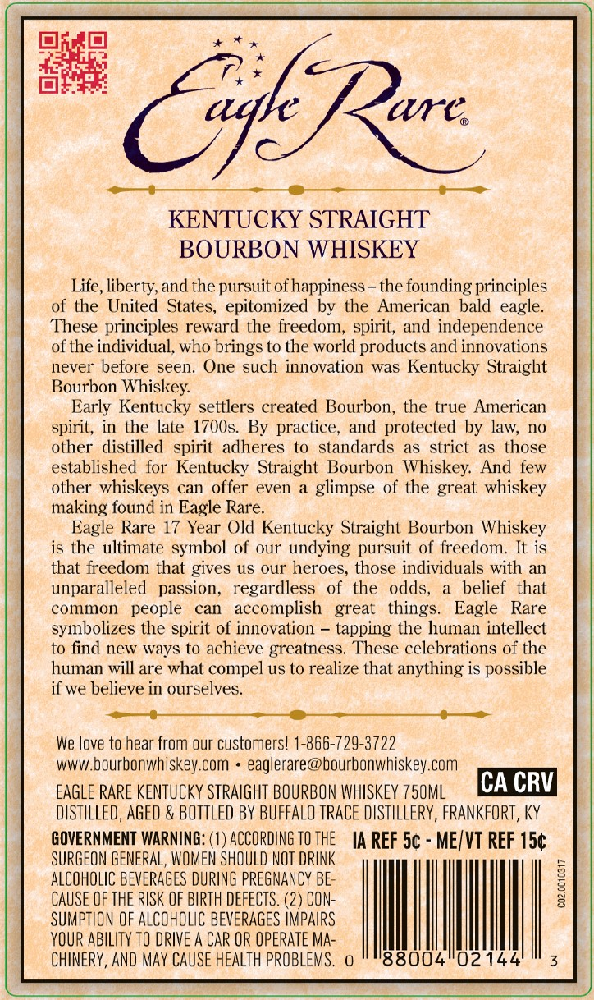
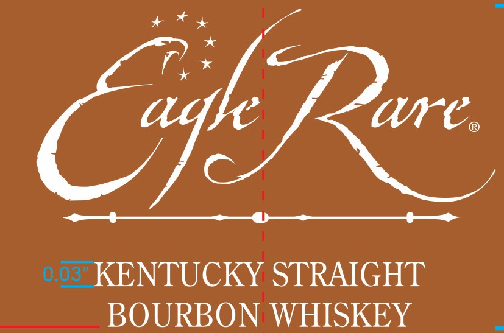
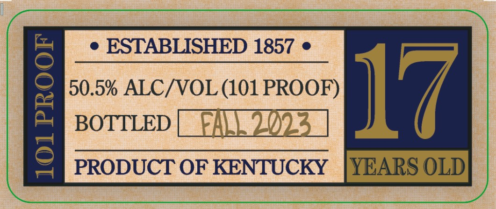
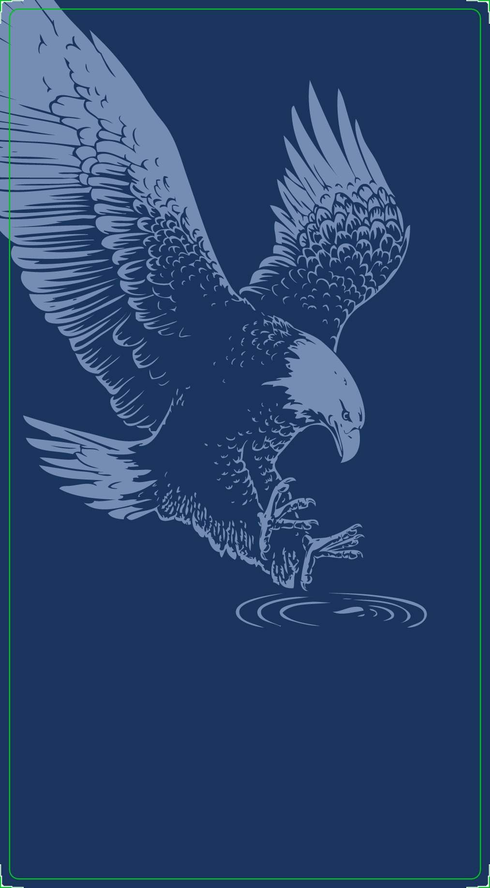

# TTB COLA Label Images - TTBID 25122001000102

**Brand Name:** EAGLE RARE

**Fanciful Name:** 17 YEARS OLD

**Issue Date:** 05/02/2025

**Origin Code:** 22

**Product Class/Type:** 101

**Source:** [TTB Public COLA Registry](https://ttbonline.gov/colasonline/viewColaDetails.do?action=publicFormDisplay&ttbid=25122001000102)

## Label Images

### Back Label

### Front Label

### Label 2

### Label 4

## Extracted Label Text

*Text extracted via OCR - may contain errors*

*3 image(s) excluded: text did not meet readability threshold*

### Back Label

eae:

Ree

KENTUCKY STRAIGHT

BOURBON WHISKEY

Life, liberty, and the pursuit of happiness - the founding principles

of the United States, epitomized by the American bald eagle.

These principles reward the freedom, spirit, and independence

of the individual, who brings to the world products and innovations

never before seen. One such innovation was Kentucky Straight

Bourbon Whiskey.

Early Kentucky settlers created Bourbon, the true American

spirit, in the late 1700s. By practice, and protected by law, no

other distilled spirit adheres to standards as strict as those

established for Kentucky Straight Bourbon Whiskey. And few

other whiskeys can offer even a glimpse of the great whiskey

making found in Eagle Rare.

Eagle Rare 17 Year Old Kentucky Straight Bourbon Whiskey

is the ultimate symbol of our undying pursuit of freedom. It is

that freedom that gives us our heroes, those individuals with an

unparalleled passion, regardless of the odds, a belief that

common people can accomplish great things. Eagle Rare

symbolizes the spirit of innovation — tapping the human intellect

ese celebrations of the

to find new ways to achieve greatne:

human will are what compel us to rea

that anything is possible

if we believe in ourselves.

—

i eee

_—>

We love to hear from our customers! 1-866-729-3722

www.bourbonwhiskey.com + eaglerare@bourbonwhiskey.com

EAGLE RARE KENTUCKY STRAIGHT BOURBON WHISKEY 750ML

ICA CRV}

DISTILLED, AGED & BOTTLED BY BUFFALO TRACE DISTILLERY, FRANKFORT, KY

GOVERNMENT WARNING: (1) ACCORDING TO THE

IA REF 5¢ - ME/VT REF 15¢

SURGEON GENERAL, WOMEN SHOULD NOT DRINK

ALCOHOLIC BEVERAGES DURING PREGNANCY BE-

CAUSE OF THE RISK OF BIRTH DEFECTS. (2) CON-

SUMPTION OF ALCOHOLIC BEVERAGES IMPAIRS

YOUR ABILITY TO DRIVE A CAR OR OPERATE MA-

|

CHINERY, AND MAY CAUSE HEALTH PROBLEMS. 0

88004°02144
