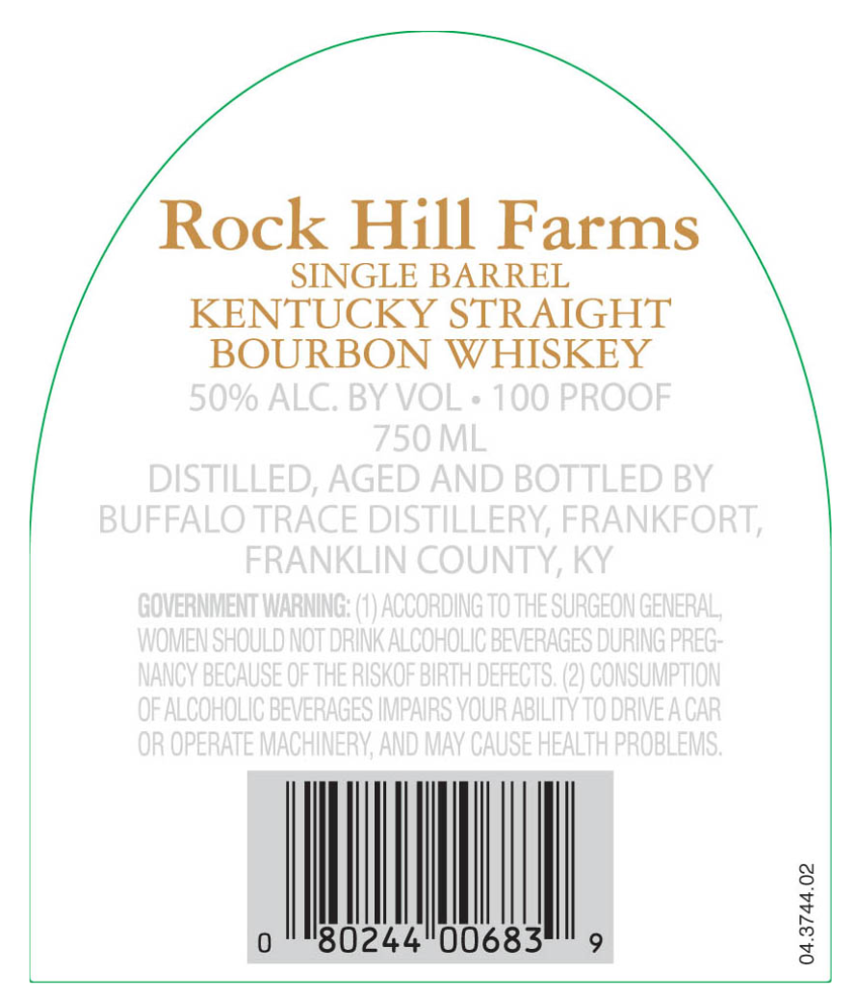
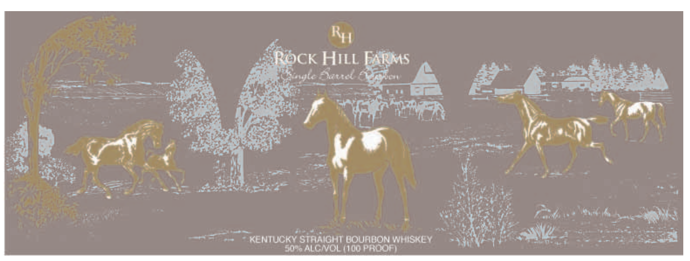
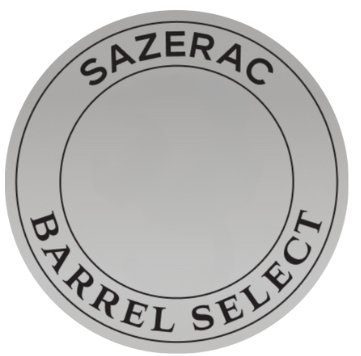

# TTB COLA Label Images - TTBID 25133001000160

**Brand Name:** ROCK HILL FARMS

**Issue Date:** 05/15/2025

**Origin Code:** 22

**Product Class/Type:** 141

**Source:** [TTB Public COLA Registry](https://ttbonline.gov/colasonline/viewColaDetails.do?action=publicFormDisplay&ttbid=25133001000160)

## Label Images

### Back Label

### Front Label

### Label 3

## Extracted Label Text

*Text extracted via OCR - may contain errors*

### Back Label

Rock Hill Farms

SINGLE BARREL

KENTUCKY STRAIGHT

BOURBON WHISKEY

|

|

|

80244°00683

### Front Label

Ry

“a

fer.

CK HILL

it

he

-5,

hatred

ax

ss

—

—

—

— ——,

avagle

~~

rt

— aE

é:

Bee:

44

is

hs

'"

#e

es ih

Vii

Ce

Sit

Vo

abe

cc

as

ce

fom Ratagiane

rer:

4

=p

al

Ny

nt

—

ve

¥

=

wn

if

wines

=

aa

.'

iit hy aE

ths

ns

_

as

é

=a:

mS as

=

E ]

* KENTUCKY

50% ALC/VOL (100 PROOF)

STRAIGHT BOURBON WHISKEY

7"

rare

ee
