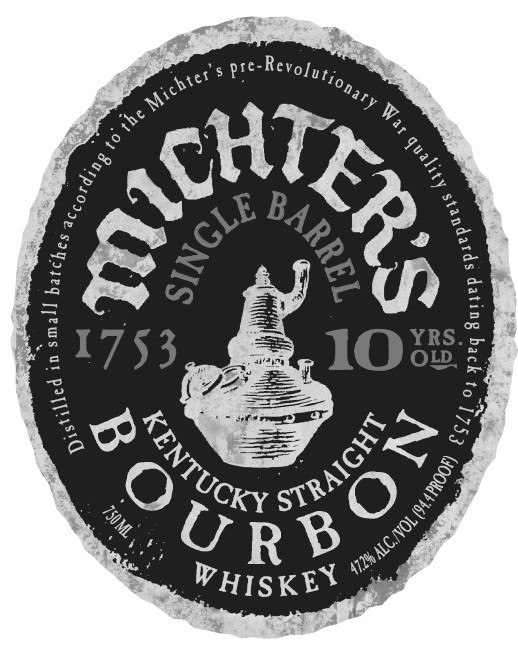
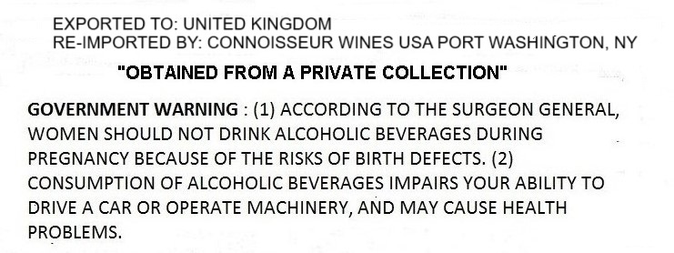

# TTB COLA Label Images - TTBID 25138001000027

**Brand Name:** MICHTER'S

**Fanciful Name:** 10 YRS OLD

**Issue Date:** 06/17/2025

**Origin Code:** 22

**Product Class/Type:** 101

**Source:** [TTB Public COLA Registry](https://ttbonline.gov/colasonline/viewColaDetails.do?action=publicFormDisplay&ttbid=25138001000027)

## Label Images

### Label 1

### Label 2

## Extracted Label Text

*Text extracted via OCR - may contain errors*

### Label 1

we Revofys,.

oor °

>

se

%e,

Y

we

Ie

Za

wn

(44

SS—

boske)

>

¥

© Lexy sO)

No

we

WHISKEY

### Label 2

EXPORTED TO: UNITED KINGDOM

RE-IMPORTED BY: CONNOISSEUR WINES USA PORT WASHINGTON, NY

“OBTAINED FROM A PRIVATE COLLECTION"

GOVERNMENT WARNING : (1) ACCORDING TO THE SURGEON GENERAL,

WOMEN SHOULD NOT DRINK ALCOHOLIC BEVERAGES DURING

PREGNANCY BECAUSE OF THE RISKS OF BIRTH DEFECTS. (2)

CONSUMPTION OF ALCOHOLIC BEVERAGES IMPAIRS YOUR ABILITY TO

DRIVE A CAR OR OPERATE MACHINERY, AND MAY CAUSE HEALTH

PROBLEMS.
