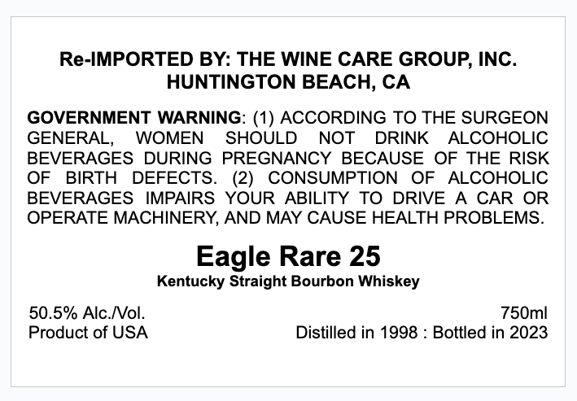
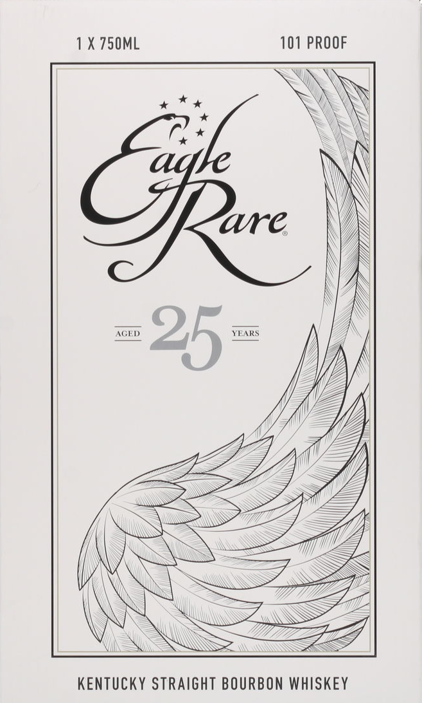

# TTB COLA Label Images - TTBID 25206001000224

**Brand Name:** EAGLE RARE

**Issue Date:** 07/29/2025

**Origin Code:** 01

**Product Class/Type:** 101

**Source:** [TTB Public COLA Registry](https://ttbonline.gov/colasonline/viewColaDetails.do?action=publicFormDisplay&ttbid=25206001000224)

## Label Images

### Back Label

### Label 1

## Extracted Label Text

*Text extracted via OCR - may contain errors*

### Back Label

Re-IMPORTED BY: THE WINE CARE GROUP, INC.

HUNTINGTON BEACH, CA

GOVERNMENT WARNING: (1) ACCORDING TO THE SURGEON

WOMEN SHOULD NOT DRINK ALCOHOLIC

GENERAL,

BEVERAGES DURING PREGNANCY BECAUSE OF THE RISK

OF BIRTH DEFECTS. (2) CONSUMPTION OF ALCOHOLIC

BEVERAGES IMPAIRS YOUR ABILITY TO DRIVE A CAR OR

OPERATE MACHINERY, AND MAY CAUSE HEALTH PROBLEMS.

Eagle Rare 25

Kentucky Straight Bourbon Whiskey

50.5% Alc./Vol.

750ml

Product of USA

Distilled in 1998 : Bottled in 2023

### Label 1

1X 750ML

101 PROOF

aan x

<i

fr x

‘

are

N

AGED

YEARS

Y

(Ai

\\

KENTUCKY STRAIGHT BOURBON WHISKEY
