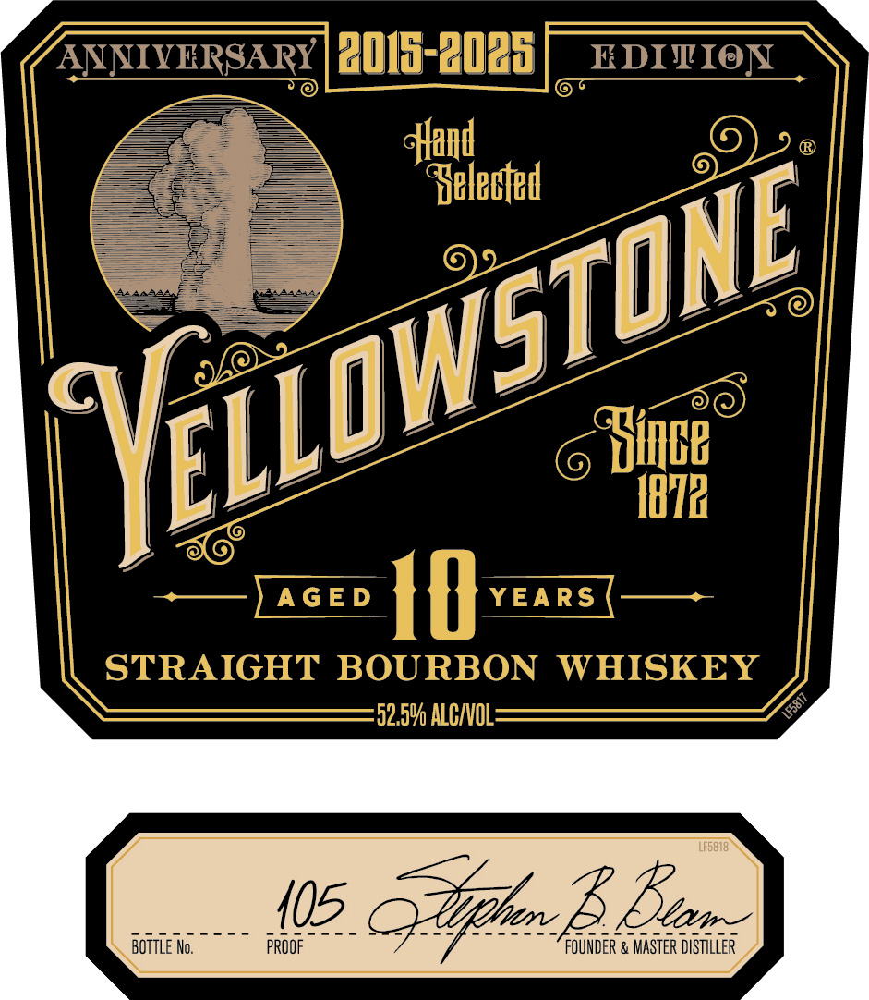
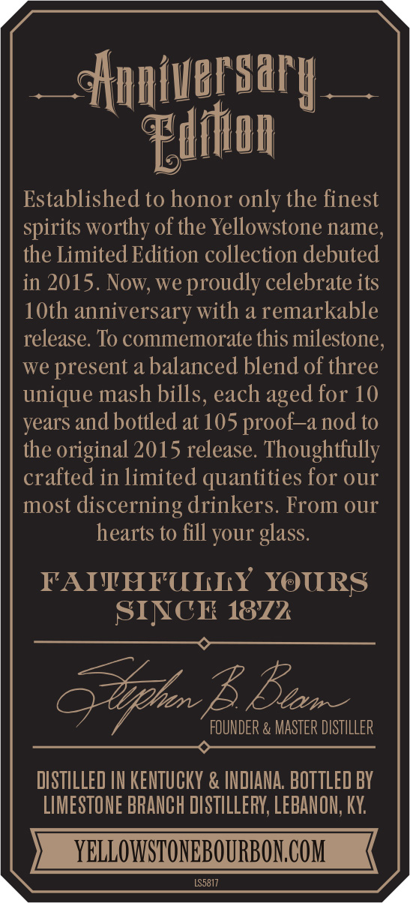
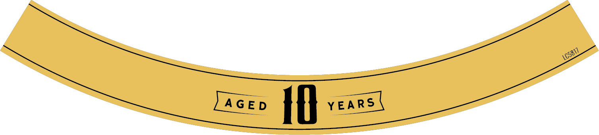

# TTB COLA Label Images - TTBID 25209001000373

**Brand Name:** YELLOWSTONE

**Issue Date:** 08/20/2025

**Origin Code:** 44

**Product Class/Type:** 121

**Source:** [TTB Public COLA Registry](https://ttbonline.gov/colasonline/viewColaDetails.do?action=publicFormDisplay&ttbid=25209001000373)

## Label Images

### Front Label

### Label 2

### Label 4

## Extracted Label Text

*Text extracted via OCR - may contain errors*

*1 image(s) excluded: text did not meet readability threshold*

### Front Label

———

( a

=

=

ae

a0la-2020) HbIviex

:

font

L

E

L

+—)AGED | YEARS (——~—

STRAIGHT BOURBON WHISKEY

52.5% ALC/VOL

SEU BSE oS 9 hey apis

(5

AEE

BOTTLE No.

PROOF

FOUND!

i & MASTER DISTILLER

### Label 2

ery | al
—Aaniversiry
ri}
Fitton
Established to honor only the finest
spirits worthy of the Yellowstone name,
the Limited Edition collection debuted
in 2015. Now, we proudly celebrate its
10th anniversary with a remarkable
release. To commemorate this milestone,
we present a balanced blend of three
unique mash bills, each aged for 10
years and bottled at 105 proof—a nod to
the original 2015 release. Thoughtfully
crafted in limited quantities for our
most discerning drinkers. From our
hearts to fill your glass.
FAITHFULLY YOURS
SINCE 1872
ee
FOUNDER & MASTER DISTILLER
OO ————————
DISTILLED IN KENTUCKY & INDIANA. BOTTLED BY
LIMESTONE BRANCH DISTILLERY, LEBANON, KY.
YELLOWSTONEBOURBON.COM
