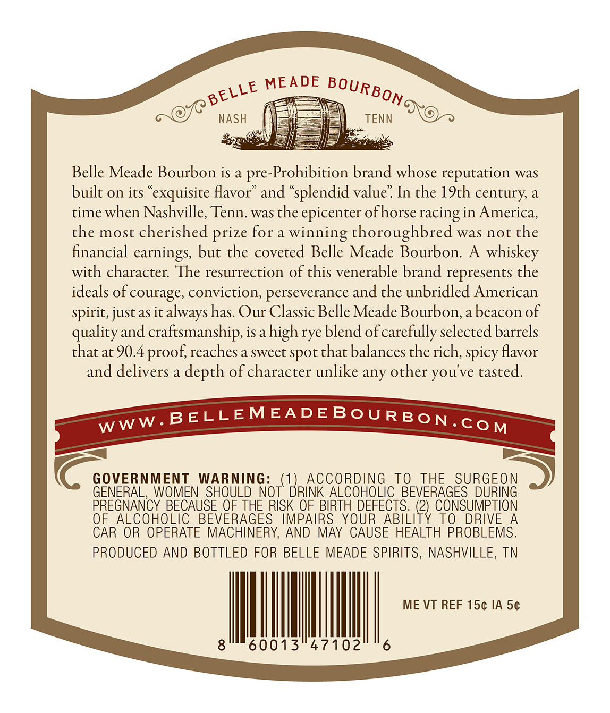
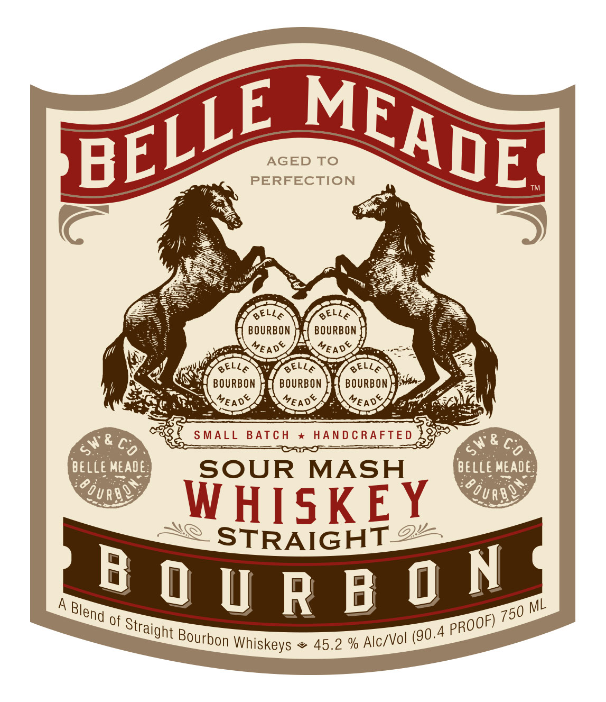
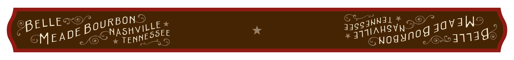

# TTB COLA Label Images - TTBID 25216001000253

**Brand Name:** BELLE MEADE BOURBON

**Issue Date:** 09/29/2025

**Origin Code:** 43

**Product Class/Type:** 121

**Source:** [TTB Public COLA Registry](https://ttbonline.gov/colasonline/viewColaDetails.do?action=publicFormDisplay&ttbid=25216001000253)

## Label Images

### Back Label

### Front Label

### Label 3

## Extracted Label Text

*Text extracted via OCR - may contain errors*

**Detected Proof:** 90.4

### Back Label

MEADE
NASH
TENN
Belle Meade Bourbon is a
pre-Prohibition brand whose reputation was
built on its
'exquisite flavor'
and "splendid value" In the 19th century; a
time when Nashville, Tenn. was the epicenter ofhorse racing in America,
the most cherished prize for a winning thoroughbred was not the
financial
but the coveted Belle Meade Bourbon: A whiskey
with character: The resurrection of this venerable brand represents the
ideals of courage, conviction, perseverance and the unbridled American
spirit, just as it always has Our Classic Belle Meade Bourbon, a beacon of
qualityand craftsmanship, isahigh rye blend of carefully selected barrels
that at 90.4
reaches a sweet spot that balances the rich, spicy flavor
and delivers a depth of character unlike any other you've tasted:
BELLEMEADEBoURBON .
GOVERNMENT
WARNING:
ACCORDiNG
To
THE
SURGEON
GENERAL,
WOMEN SHOULD NOT"
KHriNG
ALCOHOLIC BEVERAGES DURING
PREGNANCY BECAUSE QF THE RISK OF BIRTH DEFECTS.
(2) CONSUMPTION
OF ALCOHOLIC BEVERAGES
IMPAIRS YOUR
ABIL
To DRIVE A
CAR OR OPERATE MACHINERY, AND MAY CAUSE HEALTH PROBLEMS.
PRODUCED AND BOTTLED FOR BELLE MEADE SPIRITS, NASHVILLE, TN
ME VT REF 15c IA 5c
60013"47102
6
BOURBONc
BELLE
earnings;
proof;
WWW.
CoM

### Front Label

AGED To
PERFECTION
TM
6ELLA
GELLA
BOURBON
BOURBON
YEADS
0&
GELLA
6ELLA
GELLA
BOURBON
BOURBON
BOURBON
MEAD&
VEADS
VEADS
S MALL
BATCH
HAN D C RAFTE D
4"&
c6
c6
BELLE MEADE:
SOUR
MASH
belLe MEADE:
3
"qUR-b@5
QUre@
WHISKEY
STRAIGHT 2
A
B 0 U R B 0 N
ML
of
4
45.2 %
MEADE
BELLE
MEAS
#&_
Blend
750
PROOF)
Straight _
Bourbon
(90.
Alc/Vol
Whiskeys

### Label 3

BELLE RBON
MEADE pou asnvitte
ies 34gg4NNGG
Sa AHSVN nod java
yoy qqiag
