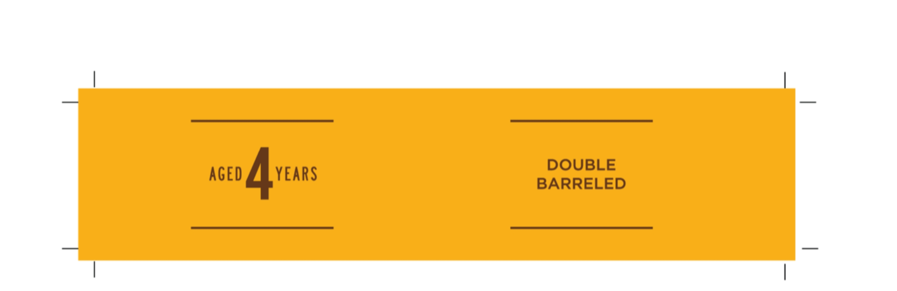
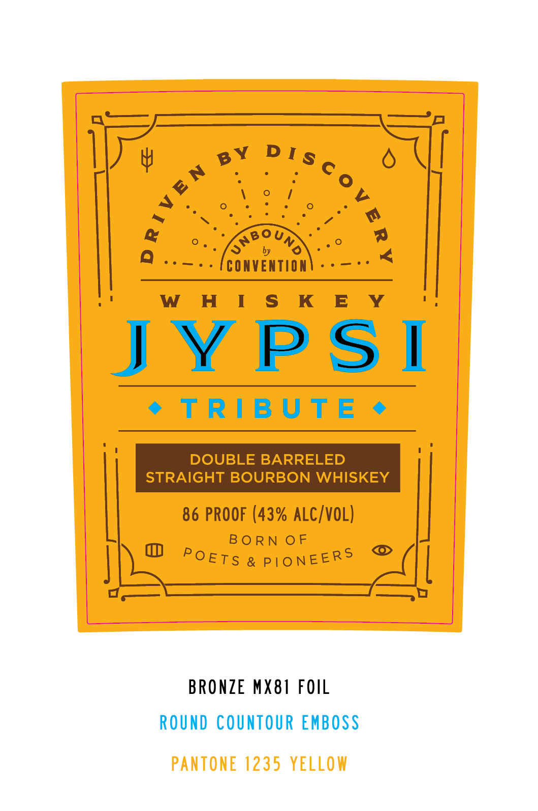

# TTB COLA Label Images - TTBID 25220001000155

**Brand Name:** WHISKEY JYPSI

**Fanciful Name:** TRIBUTE

**Issue Date:** 08/13/2025

**Origin Code:** 43

**Product Class/Type:** 101

**Source:** [TTB Public COLA Registry](https://ttbonline.gov/colasonline/viewColaDetails.do?action=publicFormDisplay&ttbid=25220001000155)

## Label Images

### Back Label

### Front Label

## Extracted Label Text

*Text extracted via OCR - may contain errors*

*1 image(s) excluded: text did not meet readability threshold*

### Front Label

& a

| oWHISKEY |!

JYPSI

° _¢* TRIBUTE ¢ — ¢

[ewer BARRELED
[ewer BOURBON WHISKEY

86 PROOF (43% ALC/VOL)
BORN OF

Jpn WM Poets g ploneeR® ||

BRONZE MX81 FOIL
ROUND COUNTOUR EMBOSS
