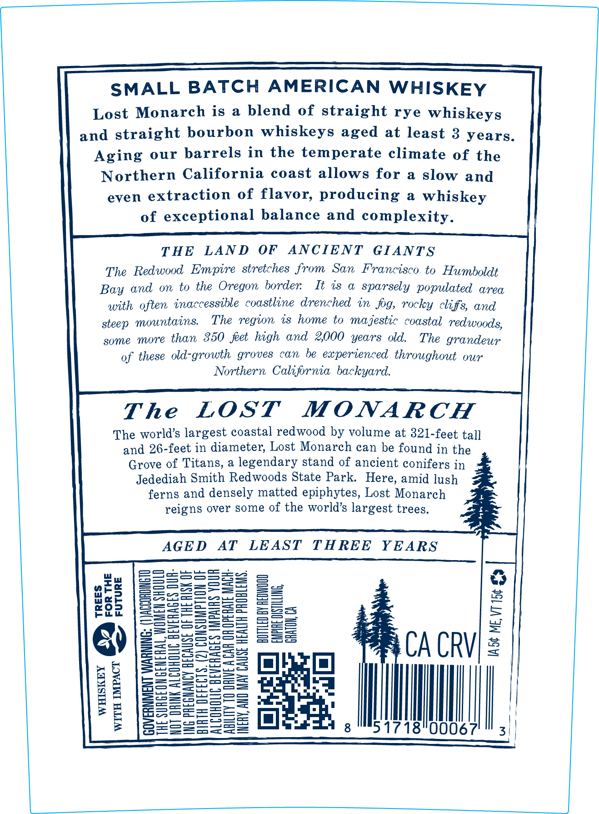
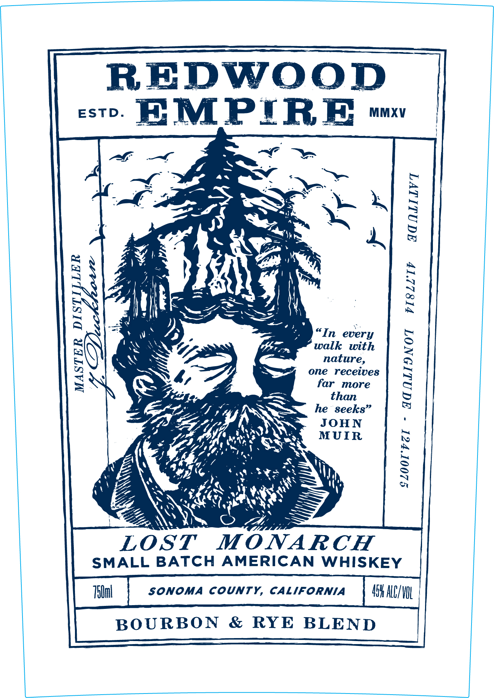

# TTB COLA Label Images - TTBID 25226001000458

**Brand Name:** REDWOOD EMPIRE

**Fanciful Name:** THE LOST MONARCH

**Issue Date:** 08/15/2025

**Origin Code:** 01

**Product Class/Type:** 140

**Source:** [TTB Public COLA Registry](https://ttbonline.gov/colasonline/viewColaDetails.do?action=publicFormDisplay&ttbid=25226001000458)

## Label Images

### Back Label

### Front Label

### Label 3

## Extracted Label Text

*Text extracted via OCR - may contain errors*

### Back Label

SMALL BATCH AMERICAN WHISKEY

Lost Monarch is a blend of straight rye whiskeys

and straight bourbon whiskeys aged at least 3 years.

Aging our barrels in the temperate climate of the

Northern California coast allows for a slow and

even extraction of flavor, producing a whiskey

of exceptional balance and complexity.

THE LAND OF ANCIENT GIANTS

The Redwood Empire stretches from San Francisco to Humboldt

Bay and on to the Oregon border It is a sparsely populated area

with often inaccessible coastline drenched in fog, rocky cliffs, and

steep mountains. The region is home to majestic coastal redwoods,

some more than 350 feet high and 2,000 years old. The grandeur

of these old-growth groves can be experienced throughout our

Northern California backyard.

The LOST MONARCH

The world’s largest coastal redwood by volume at 821-feet tal]

and 26-feet in diameter, Lost Monarch can be found in the

Grove of Titans, a legendary stand of ancient conifers in

Jedediah Smith Redwoods State Park. Here, amid lush

ferns and densely matted epiphytes, Lost Monarch

reigns over some of the world’s largest trees.

AGED AT LEAST THREE YEARS

ci

od

———7—

SoS

td

4

22S5=2S5=

a

SS

=

Ss=

=

ute

“205

Snorer

osu

<==

4

oS

arg

au

==

ao)

o—- =

4

=o"

=r

Bs

—SSS5n=S

Eas

—i-——)

j=

earonow

=

@)

a

=o Seotae =

CACRV/ = |

SS

==55

a

bS—

eo aS

Holt nS ws

ob

ao=

SeoSS=

=

De

=o

oeSc

Pf)

4

tl

ox

|

S252

==

Sots

oO)

I

2=oaot—

31718"0006

|

### Front Label

REDWOOD

ESTD EMPIRE fiaxy

a os

an

yo

x

74

ste,

4“

A

we

4

|

FL oe

SS

4

NS

W

7

In every

Porm

walk with

Ss

nature,

one recetves

cS

—

far more

an

he seeks”

JOHN

PE; tS

MUIR

SZ Zi

Yai PS

hy

Z

a ae

ae

\iZ

oa

JA

a

~

wy

Roe sa He

Z

\

NK

oo

OST MONARCH

SMALL BATCH AMERICAN WHISKEY

44 ALC/VOL

BOURBON & RYE BLEND

### Label 3

IF PeeeeeeeeeeeeeeeTeUTUUTUOUUOUUUOTT .,, WUUUUUUUNN NUNN NEU UNUUNNTUUTU UOTE

D neannnanananeananennaneneananentn | _ahtapaneaeananeasaneaeasansssaneeall
