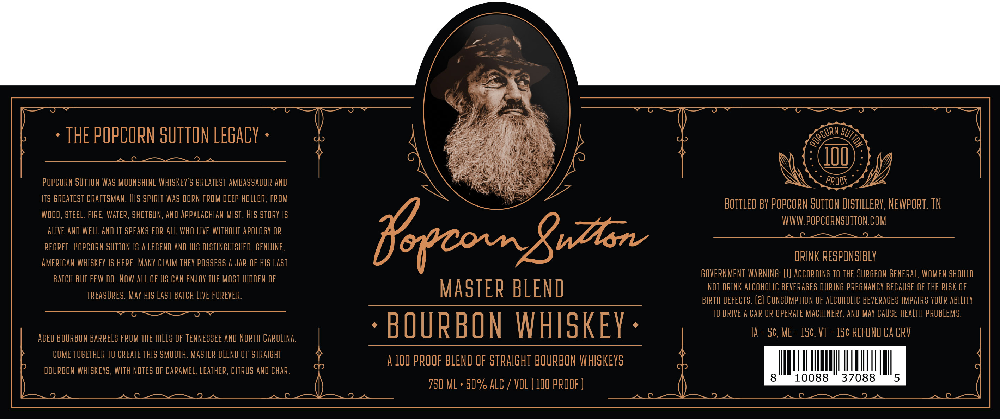

# TTB COLA Label Images - TTBID 25269001000394

**Brand Name:** POPCORN SUTTON

**Issue Date:** 09/30/2025

**Origin Code:** 43

**Product Class/Type:** 121

**Source:** [TTB Public COLA Registry](https://ttbonline.gov/colasonline/viewColaDetails.do?action=publicFormDisplay&ttbid=25269001000394)

## Label Images

### Label 1

### Label 2

## Extracted Label Text

*Text extracted via OCR - may contain errors*

*1 image(s) excluded: text did not meet readability threshold*

**Detected Proof:** 100

### Label 1

THE POPCOPN SUTTON LEGacy
100
POPCORN SuTTon Was MOONSHINE WhISkeY'S Greatest AMBASSAdOp AND
PPOOF
ITS GPEATEST CRAFTSMaN . HIS SPIPIT Was BORN FPOM DEEP hOLLeR; FROM
BOttled BY POPCOrN SuTTon Distillery, NEwPOPT, TN
wood , steel, FIPE, Watep, SHOTGUN, and AppaLachian MIST . HIs STOPV IS
WWW.popCornSuTTON COM
alive AnD weLL AND IT spEAKS FOP alL WHO LIVE WITHOUT ApOLOgy OP
fooconXrzlon
pegret . POPCORN SUTTON /S A LEGEND AND HIS DISTINGUISHED, GENUINE,
DRINK RESPONSIBLY
AMErICaN WHISKEY IS heRe: ManY CLaIM thEY posSeSS A Jap OF HIS Last
BATCh BUT FEW DO . Now alL OF US CaN ENJOY THE MOST HIDDEN OF
GOVERNMENT WARNING: (1} AcCOrdiNg tO THE SURGEON General, WOMEN shouLD
MASTER BLEND
NOT DRINK ALCOHOLIC BEVERAGES @URING PREGNANCY BECAUSE OF THE RISK OF
ipeasupes. May hIS Last BATCH LIVE FOREVER
BIRTH dEfECTS. (2} CONSUMPTON OF ALCOHOLIC BEVERAGES IMPAIRS YOUR ABILITy
TO DPIVE A Cap OP OPERATe MACHINEPY , AND May Cause HEaLTh PROBLEMS.
AGEd BOURBON BARRELS FROM THE hILLS OF TENNESSEE AND North CAROLiNa;
BOURBON WHISKEY
Ia
Sc, ME
1Sc,VT
1Sc REFUND Ca CRV
COME TOGETHEP TO CREATe ThIS SMOOTH, MasTEp BLEND OF STRAIGHT
A 100 pROOF BLEND OF StpaIGHT BOURBON WHISKEYS
BOURBON WHISKEvS , WITH NOTES OF Caramel, LEaThER, CITpuS AND CHAP
8
10088
37088
5
750 ML . 5q% ALC
vOL ( 1OO pROOF )
ROPCORN ,
"sutTon
